# API Module

The API module provides a RESTful HTTP API for managing DSB sandboxes using the Axum web framework. It handles all HTTP requests, authentication, and response formatting.

## Table of Contents

1. [Overview](#overview)
2. [Architecture](#architecture)
3. [Router Structure](#router-structure)
4. [Authentication](#authentication)
5. [Request Handlers](#request-handlers)
6. [Server Initialization](#server-initialization)
7. [Error Handling](#error-handling)
8. [Testing Strategy](#testing-strategy)
9. [File Structure](#file-structure)
10. [Usage Examples](#usage-examples)

---

## Overview

The API module provides:

- **RESTful Endpoints**: CRUD operations for sandboxes, activities, SSH sessions, and static files
- **Authentication**: API key validation via `X-API-Key` header
- **Server-Sent Events (SSE)**: Progress streaming for sandbox creation
- **WebSocket Support**: Terminal access to sandboxes
- **Error Handling**: Consistent error responses with helpful hints

---

## Architecture

### System Architecture

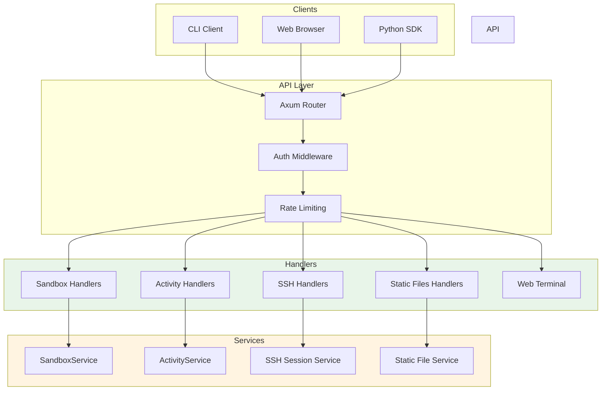

### Request Flow

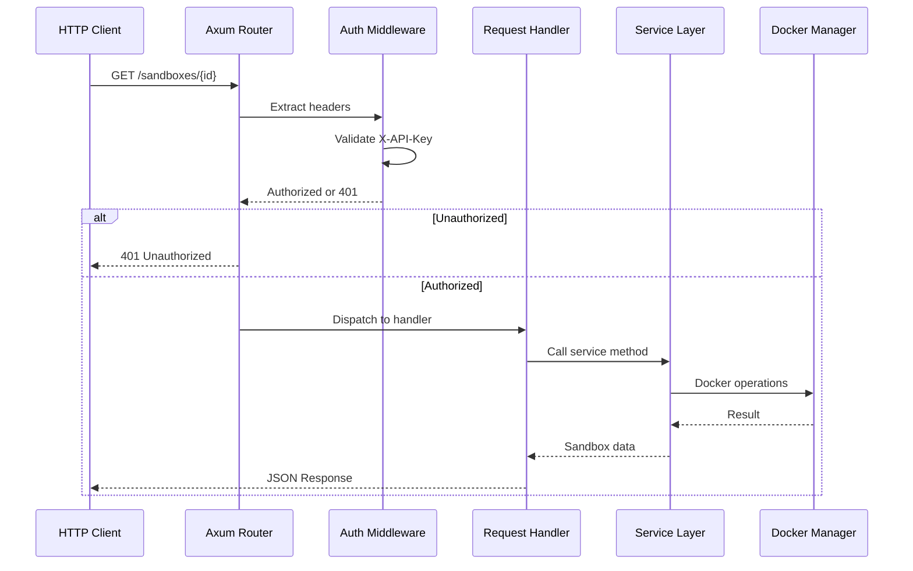

---

## Router Structure

### Route Hierarchy

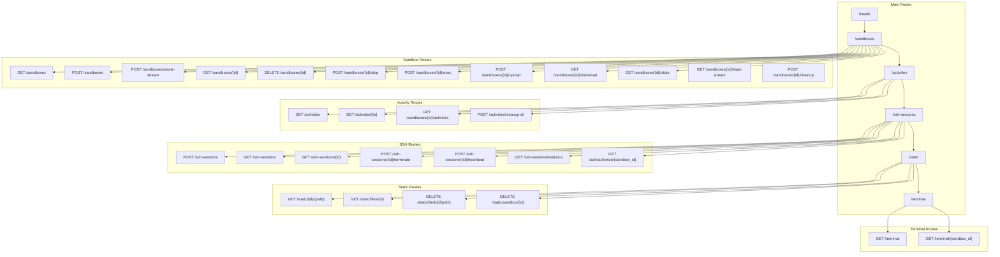

### Router Configuration

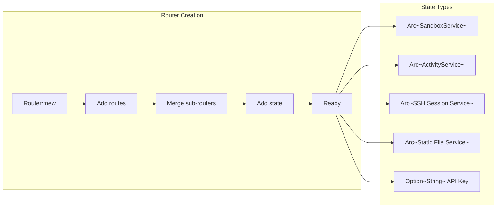

---

## Authentication

### API Key Authentication Flow

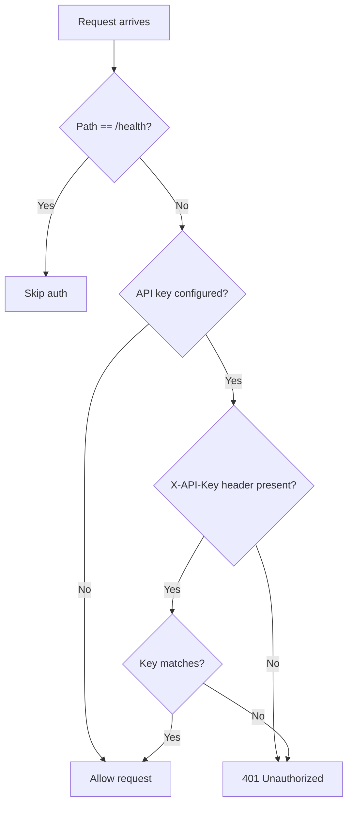

### Auth Middleware Code Flow

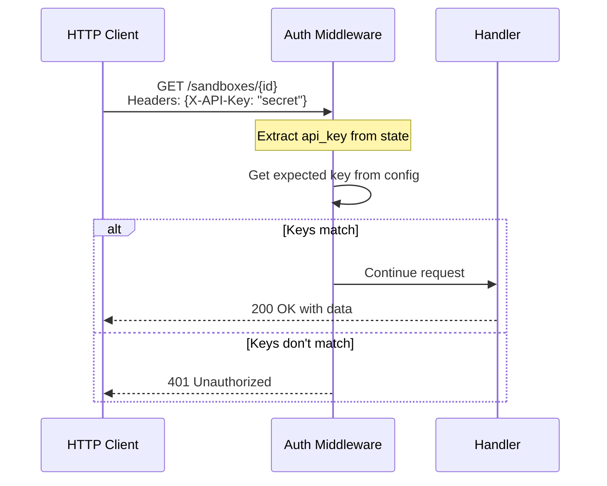

---

## Request Handlers

### Handler Categories

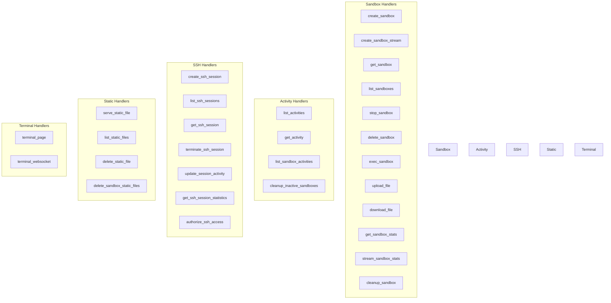

### Create Sandbox Handler Flow

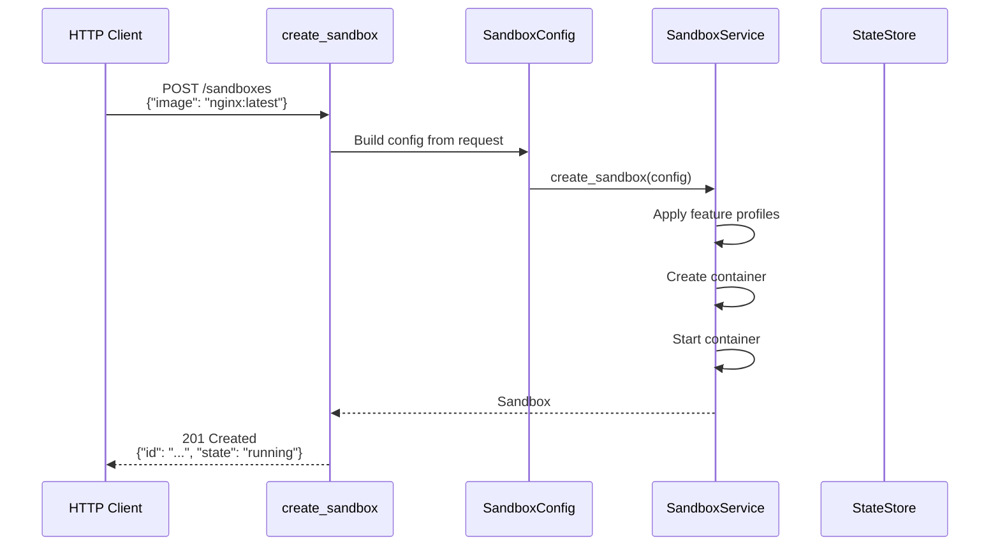

### SSE Progress Streaming

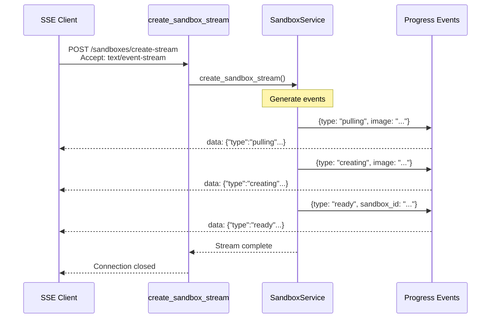

---

## Server Initialization

### Startup Sequence

```mermaid
flowchart TD
    A[start_server(config)] --> B[Create Docker Manager]
    B --> C{Check DB config}
    C -->|PostgreSQL| D[Create PostgresStateStore]
    C -->|No DB| E[Create InMemory StateStore]

    D --> F[Create ActivityService]
    E --> F

    F --> G[Create SandboxService]
    G --> H[Create SSH Session Service]
    H --> I[Create Static File Service]

    I --> J[Create API Key from config]
    J --> K[Build Router]

    K --> L[Add health route]
    L --> M[Add sandbox routes]
    M --> N[Add activity routes]
    N --> O[Add SSH routes]
    O --> P[Add static routes]
    P --> Q[Add terminal routes]
    Q --> R[Merge all routes]
    R --> S[Bind to socket]
    S --> T[Start listening]

    style A fill:#e1f5fe
    style T fill:#c8e6c9
```

---

## Error Handling

### Error Response Format

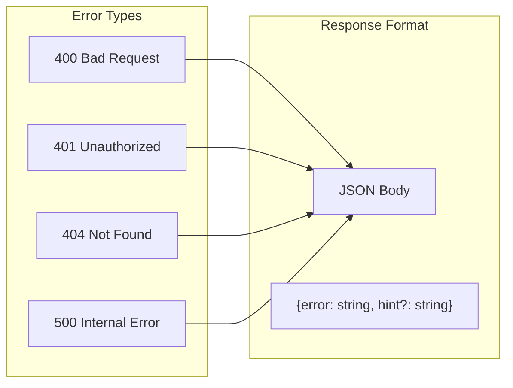

### Error Mapping

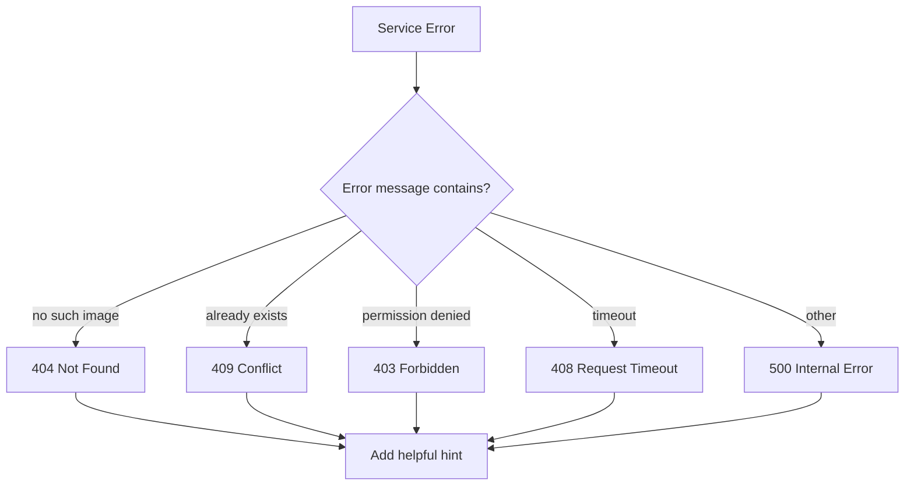

---

## Testing Strategy

### Test Pyramid

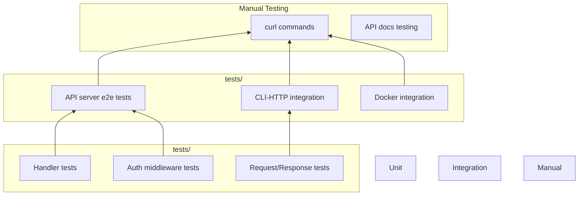

---

## File Structure

```
src/api/
├── mod.rs                    # Module exports, build_test_router
├── server/
│   └── mod.rs                # start_server function (10KB)
│       ├── start_server()    # Server initialization
│       ├── build_router()    # Route configuration
│       └── services          # Service creation
├── handlers/
│   ├── mod.rs                # Handler exports
│   ├── sandbox.rs            # Sandbox CRUD (40KB)
│   │   ├── create_sandbox()
│   │   ├── create_sandbox_stream()
│   │   ├── get_sandbox()
│   │   ├── list_sandboxes()
│   │   ├── stop_sandbox()
│   │   ├── delete_sandbox()
│   │   ├── exec_sandbox()
│   │   ├── upload_file()
│   │   ├── download_file()
│   │   ├── get_sandbox_stats()
│   │   └── stream_sandbox_stats()
│   ├── activities.rs         # Activity endpoints (13KB)
│   │   ├── list_activities()
│   │   ├── get_activity()
│   │   ├── list_sandbox_activities()
│   │   └── cleanup_inactive_sandboxes()
│   ├── ssh.rs                # SSH session handlers (26KB)
│   │   ├── create_ssh_session()
│   │   ├── list_ssh_sessions()
│   │   ├── get_ssh_session()
│   │   ├── terminate_ssh_session()
│   │   └── update_session_activity()
│   ├── static_files.rs       # Static file handlers (22KB)
│   │   ├── serve_static_file()
│   │   ├── list_static_files()
│   │   ├── delete_static_file()
│   │   └── delete_sandbox_static_files()
│   ├── health.rs             # Health check (2.4KB)
│   │   └── health_check()
│   └── execution_tests.rs    # CLI execution tests (15KB)
└── auth.rs                   # Authentication middleware (10KB)
    ├── api_key_auth()        # Auth middleware
    └── is_api_key_valid()    # Key validation helper
```

---

## Usage Examples

### Making API Requests

```bash
# Create a sandbox
curl -X POST http://localhost:8080/sandboxes \
  -H "Content-Type: application/json" \
  -d '{"image": "nginx:alpine"}'

# List sandboxes
curl http://localhost:8080/sandboxes \
  -H "X-API-Key: your-secret-key"

# Execute command
curl -X POST http://localhost:8080/sandboxes/{id}/exec \
  -H "Content-Type: application/json" \
  -H "X-API-Key: your-secret-key" \
  -d '{"command": ["ls", "-la"]}'

# Upload a file to sandbox
curl -X POST http://localhost:8080/sandboxes/{id}/upload \
  -F "path=/app/config.json" \
  -F "file=@local-config.json"

# Download a file from sandbox
curl -O -J "http://localhost:8080/sandboxes/{id}/download?path=/app/config.json"

# Or download to specific filename
curl -o local-config.json "http://localhost:8080/sandboxes/{id}/download?path=/app/config.json"

# View file inline (in browser)
curl -O -J "http://localhost:8080/sandboxes/{id}/download?path=/app/page.html&disposition=inline"

# Stream statistics
curl -N http://localhost:8080/sandboxes/{id}/stats-stream \
  -H "X-API-Key: your-secret-key"
```

### SSE Progress Streaming

```javascript
const eventSource = new EventSource(
  'http://localhost:8080/sandboxes/create-stream',
  {
    method: 'POST',
    headers: { 'Content-Type': 'application/json' },
    body: JSON.stringify({ image: 'nginx:alpine' })
  }
);

eventSource.onmessage = (event) => {
  const data = JSON.parse(event.data);
  console.log('Progress:', data);
};
```

---

## See Also

- [Core Module](../core/README.md) - Sandbox service
- [Docker Module](../docker/README.md) - Container management
- [CLI Module](../cli/README.md) - Command-line interface
- [Static File Serving](../../src/core/static_files.rs) - Static file endpoints
