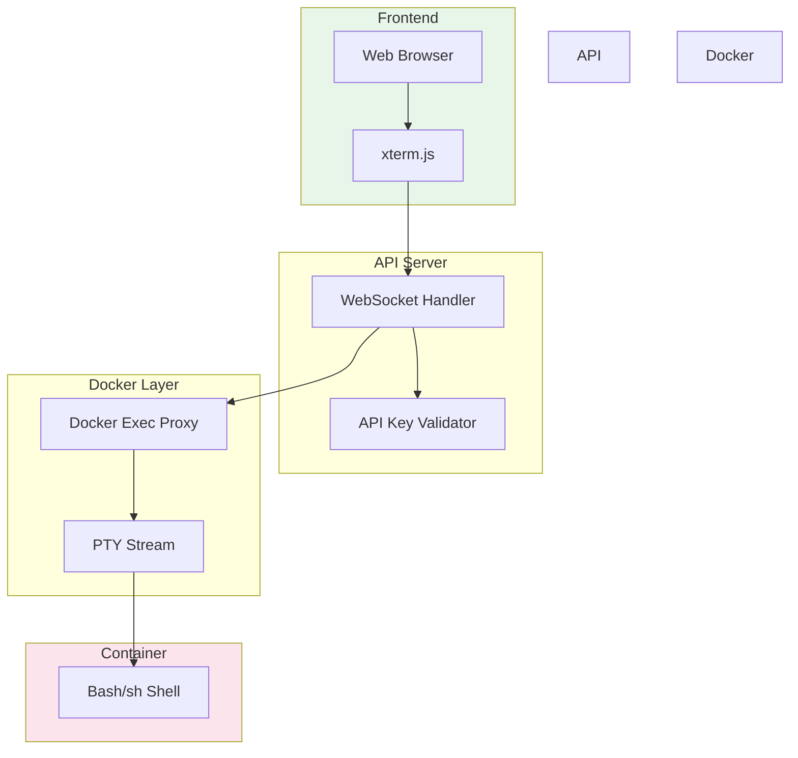
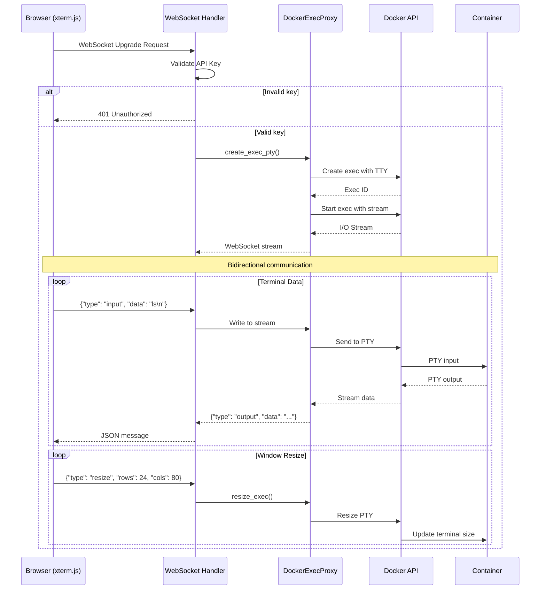
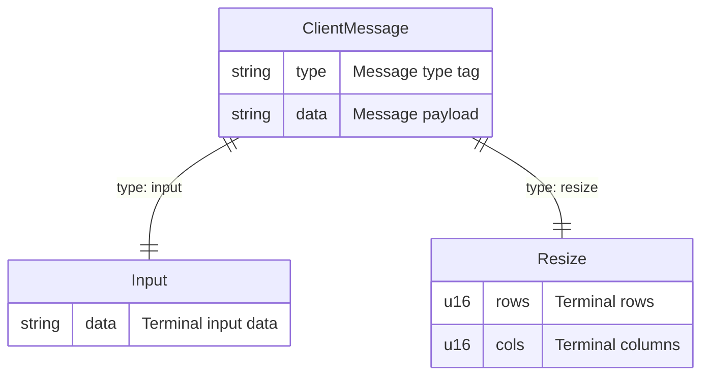
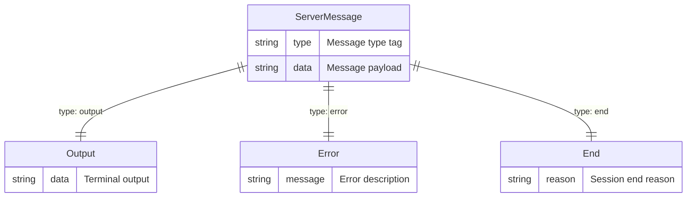
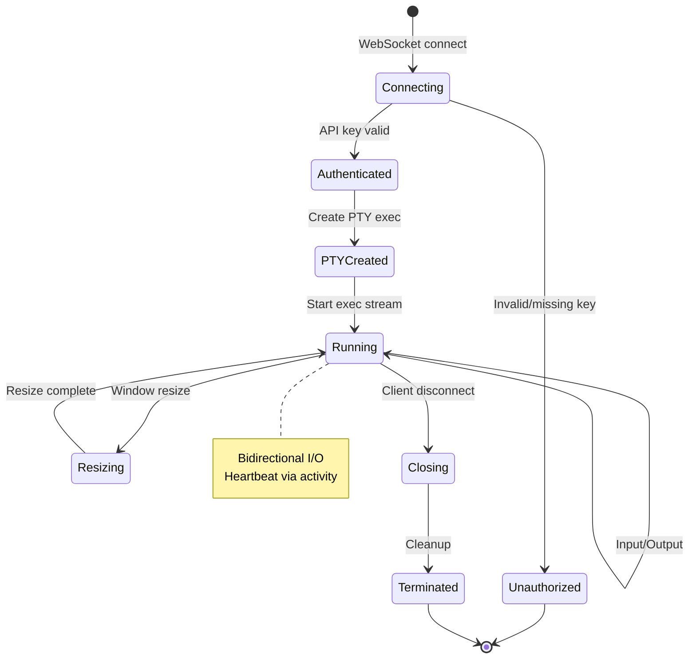
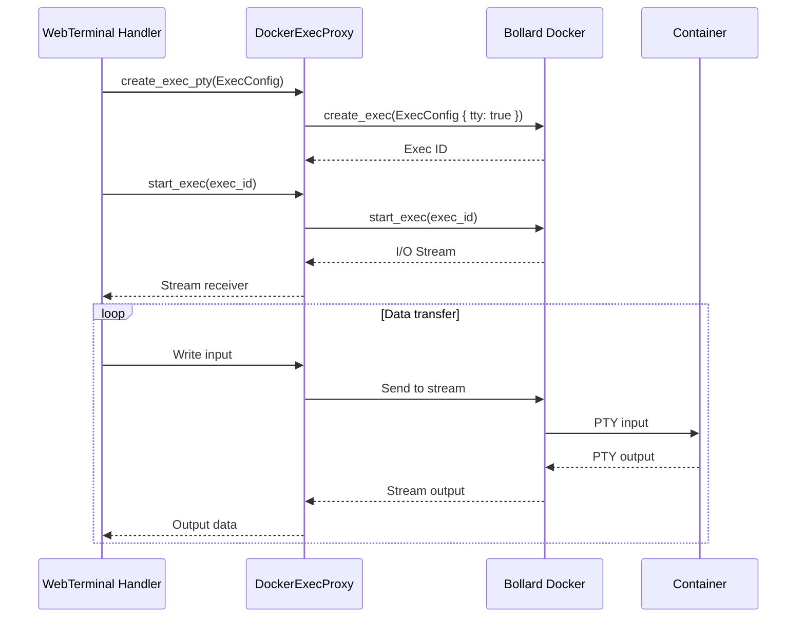
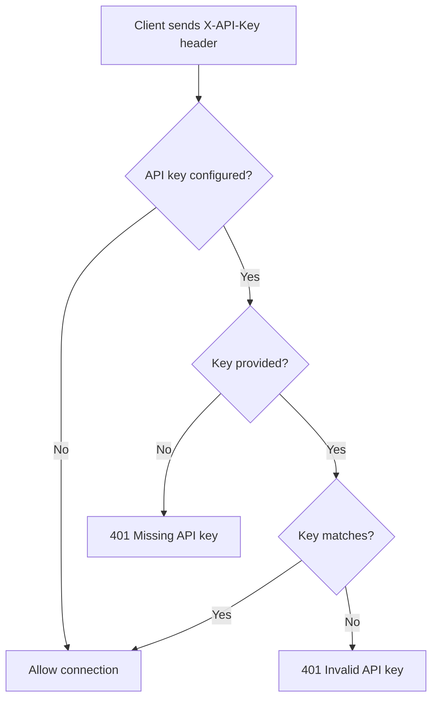

# Web Terminal Module

The Web Terminal module provides WebSocket-based terminal access to Docker containers using xterm.js for the frontend.

## Table of Contents

1. [Overview](#overview)
2. [Architecture](#architecture)
3. [WebSocket Protocol](#websocket-protocol)
4. [Message Types](#message-types)
5. [Session Flow](#session-flow)
6. [Authentication](#authentication)
7. [File Structure](#file-structure)
8. [Usage Examples](#usage-examples)

---

## Overview

The Web Terminal module provides:

- **WebSocket Communication**: Bidirectional real-time communication
- **PTY Support**: Pseudo-terminal allocation for interactive shell
- **Window Resizing**: Dynamic PTY size synchronization
- **Authentication**: Optional API key validation
- **Error Handling**: Structured error responses
- **Multiple Sessions**: Support for concurrent connections

---

## Architecture

### System Architecture



### Data Flow



---

## WebSocket Protocol

### Connection Flow

```mermaid
flowchart TD
    A[Open /terminal/{sandbox_id}] --> B[HTTP Request]
    B --> C{Upgrade to WebSocket?}
    C -->|No| D[400 Bad Request]
    C -->|Yes| E[Validate API Key]

    E --> F{Valid?}
    F -->|No| G[401 Unauthorized]
    F -->|Yes| H[Create PTY Exec]

    H --> I[Start Exec with Stream]
    I --> J[Handle Messages]

    J --> K{Connection Open?}
    K -->|Yes| L[Process I/O]
    K -->|No| M[Cleanup]

    L --> J
```

---

## Message Types

### Client Messages



#### Input Message

```json
{
  "type": "input",
  "data": "ls -la\n"
}
```

#### Resize Message

```json
{
  "type": "resize",
  "data": {
    "rows": 24,
    "cols": 80
  }
}
```

### Server Messages



#### Output Message

```json
{
  "type": "output",
  "data": "user@sandbox:~$ ls\nfile1.txt  file2.txt\n"
}
```

#### Error Message

```json
{
  "type": "error",
  "data": "Container not found"
}
```

#### End Message

```json
{
  "type": "end",
  "data": "Connection closed by client"
}
```

---

## Session Flow

### Session Lifecycle



### PTY Creation Flow



---

## Authentication

### API Key Validation Flow



### Validation Logic

```rust
pub fn validate_api_key(
    api_key: &Option<String>,
    expected_key: &Option<String>,
) -> Result<(), WebTerminalError> {
    if let Some(expected) = expected_key {
        match api_key {
            Some(provided_key) if provided_key == expected => Ok(()),
            Some(_) => Err(WebTerminalError::Unauthorized(
                "Invalid API key".to_string(),
            )),
            None => Err(WebTerminalError::Unauthorized(
                "Missing API key".to_string(),
            )),
        }
    } else {
        Ok(()) // No key required
    }
}
```

---

## File Structure

The web terminal is implemented as a single file rather than a module directory, since it has a small surface area (~700 LOC).

```
src/web_terminal.rs              # Main file
├── WebTerminalError             # Error types
│   ├── ContainerNotFound
│   ├── ExecCreationFailed
│   ├── ExecStartFailed
│   ├── WebSocketError
│   ├── DockerConnectionFailed
│   └── Unauthorized
├── ClientMessage                # Client → Server messages
│   ├── Input(String)           # Terminal input
│   └── Resize { rows, cols }   # PTY resize
├── ServerMessage               # Server → Client messages
│   ├── Output(String)          # Terminal output
│   ├── Error(String)           # Error message
│   └── End                     # Session end
├── OptionalApiKey              # Request extractor
├── terminal_page()             # Serve HTML page
├── terminal_websocket()        # WebSocket handler
└── validate_api_key()          # Auth validation
```

### Integration with API Server

```mermaid
flowchart LR
    subgraph API Server
        Router[Axum Router]
        TerminalRoutes["/terminal", "/terminal/{id}"]
    end

    subgraph web_terminal Module
        Page[terminal_page]
        WS[terminal_websocket]
    end

    subgraph Docker Module
        Proxy[DockerExecProxy]
    end

    Router -->|GET /terminal| Page
    Router -->|WS /terminal/{id}| WS
    WS --> Proxy

    style Router fill:#e1f5fe
    style Page fill:#c8e6c9
    style WS fill:#c8e6c9
```

---

## Usage Examples

### Connecting via WebSocket

```javascript
// Using xterm.js
const term = new Terminal();
term.open(document.getElementById('terminal'));

const ws = new WebSocket(
  'ws://localhost:8080/terminal/550e8400-e29b-41d4-a716-446655440000',
  ['X-API-Key: your-secret-key']
);

ws.onmessage = (event) => {
  const msg = JSON.parse(event.data);
  if (msg.type === 'output') {
    term.write(msg.data);
  } else if (msg.type === 'error') {
    console.error(msg.data);
  } else if (msg.type === 'end') {
    console.log('Session ended');
  }
};

term.onData((data) => {
  ws.send(JSON.stringify({ type: 'input', data }));
});

term.onResize((size) => {
  ws.send(JSON.stringify({
    type: 'resize',
    data: { rows: size.rows, cols: size.cols }
  }));
});
```

### Accessing the Terminal Page

```bash
# Open in browser
http://localhost:8080/terminal/550e8400-e29b-41d4-a716-446655440000
```

### Error Handling

```javascript
ws.onerror = (error) => {
  console.error('WebSocket error:', error);
};

ws.onclose = (event) => {
  if (event.code === 1000) {
    console.log('Normal closure');
  } else {
    console.log('Connection lost:', event.reason);
  }
};
```

---

## See Also

- [API Module](./api.md) - API server integration
- [Docker Module](./docker.md) - PTY execution
- [Core Module](./core.md) - Sandbox service
