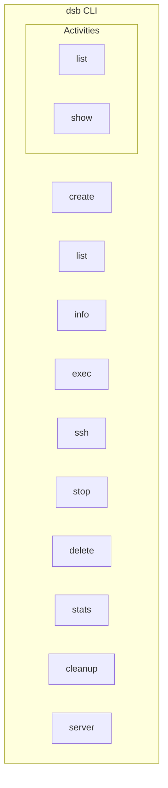
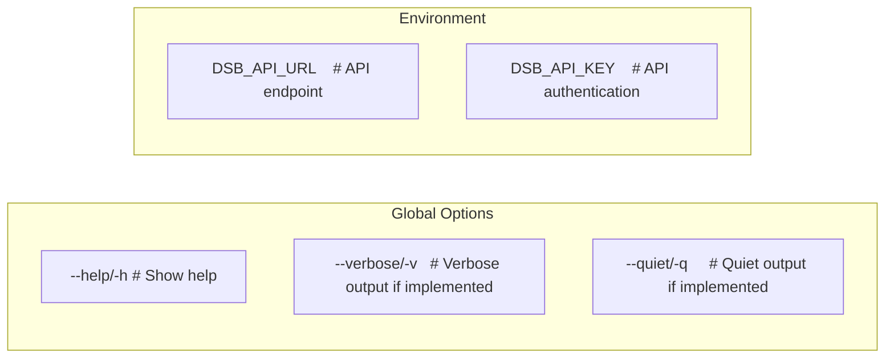
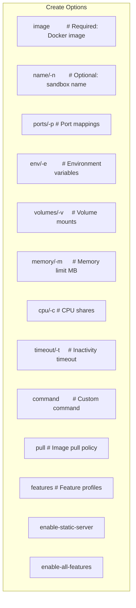
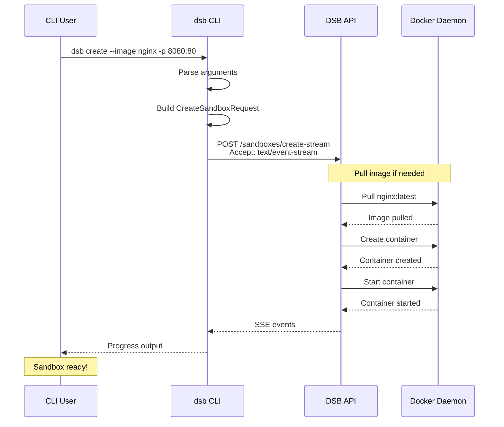
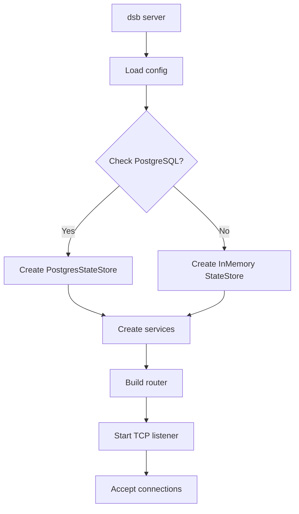
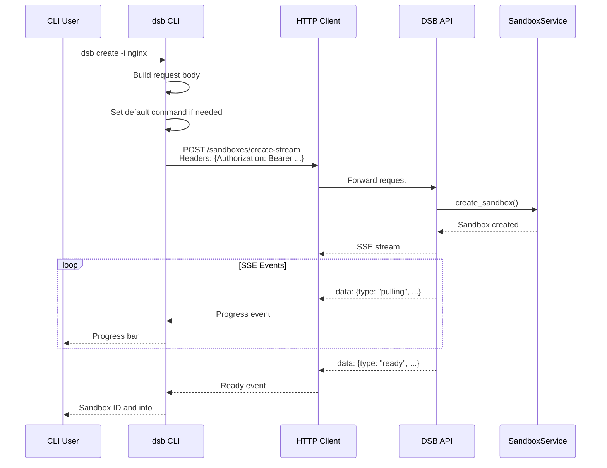
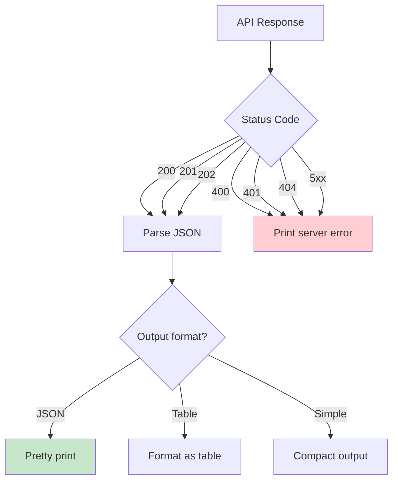
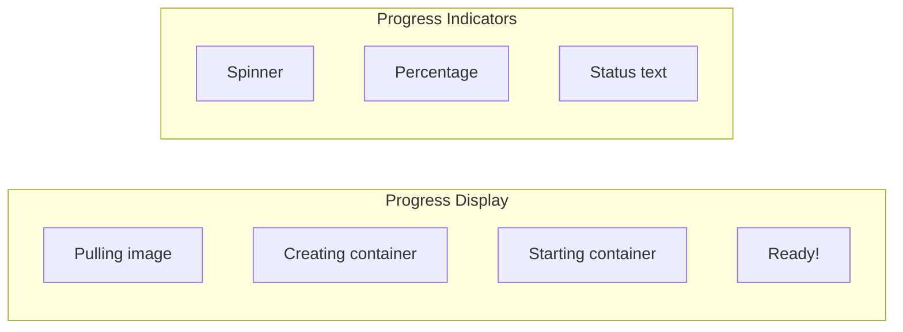

# CLI Module

The CLI module provides a command-line interface for managing DSB sandboxes using the Clap framework. It offers a user-friendly way to interact with the DSB API server.

## Table of Contents

1. [Overview](#overview)
2. [Command Structure](#command-structure)
3. [Global Options](#global-options)
4. [Commands](#commands)
5. [Command Flow](#command-flow)
6. [Output Formatting](#output-formatting)
7. [File Structure](#file-structure)
8. [Usage Examples](#usage-examples)

---

## Overview

The CLI module provides:

- **Create Command**: Create sandboxes with various configurations
- **Management Commands**: List, info, stop, delete sandboxes
- **Execution**: Execute commands in running sandboxes
- **Monitoring**: Get and stream resource statistics
- **Server Control**: Start the DSB API server
- **Activity Tracking**: Monitor sandbox activity

---

## Command Structure

### Command Hierarchy



### Command Tree

```
dsb
├── create          Create a new sandbox
├── list            List all sandboxes
├── info            Get sandbox details
├── exec            Execute command in sandbox
├── ssh             SSH into sandbox
├── stop            Stop a sandbox
├── delete          Delete a sandbox
├── stats           Get sandbox statistics
├── cleanup         Force cleanup sandbox
├── server          Start API server
└── activities      Activity tracking
    ├── list        List recent activities
    └── show        Show activity details
```

---

## Global Options

### Global Flags



---

## Commands

### Create Command

The `create` command provisions a new sandbox with specified configuration.



#### Create Command Flow



### List Command

```mermaid
flowchart LR
    subgraph List Options
        L1[--activity/-a]  # Show activity info
    end

    subgraph Output
        T1[ID]
        T2[Name]
        T3[Image]
        T4[State]
        T5[Created]
    end
```

### Exec Command

```mermaid
flowchart TD
    A[dsb exec <id> <command>] --> B{Command has operators?}
    B -->|Yes| C[Wrap with: sh -c "command"]
    B -->|No| D[Keep as-is]

    C --> E[Send to API]
    D --> E

    E --> F[POST /sandboxes/{id}/exec]
    F --> G[API wraps with sh -c]
    G --> H[Docker exec]
    H --> I[Return output]

    style B fill:#fff4e1
    style G fill:#c8e6c9
```

### Stats Command

```mermaid
flowchart LR
    subgraph Stats Options
        S1[--stream/-s]    # Real-time streaming
    end

    subgraph Output
        O1[CPU %]
        O2[Memory used/limit]
        O3[Network I/O]
        O4[Block I/O]
    end
```

### Server Command



---

## Command Flow

### API Request Flow



### Response Handling Flow



---

## Output Formatting

### Progress Output



### Table Output

```text
┌─────────────────────────────────────┬──────────┬────────────────┬──────────┐
│ ID                                  │ NAME     │ IMAGE          │ STATE    │
├─────────────────────────────────────┼──────────┼────────────────┼──────────┤
│ 550e8400-e29b-41d4-a716-446655440000│ webapp   │ nginx:alpine   │ Running  │
│ a1b2c3d4-e5f6-7890-abcd-ef1234567890│ database │ postgres:15    │ Stopped  │
└─────────────────────────────────────┴──────────┴────────────────┴──────────┘
```

---

## File Structure

```
src/cli/
├── mod.rs                    # Module exports (454B)
├── commands.rs               # CLI commands (134KB)
│   ├── Cli                   # Main CLI struct
│   ├── Commands              # Command enum
│   ├── Create                # Create subcommand
│   ├── List                  # List subcommand
│   ├── Info                  # Info subcommand
│   ├── Exec                  # Exec subcommand
│   ├── Ssh                   # SSH subcommand
│   ├── Stop                  # Stop subcommand
│   ├── Delete                # Delete subcommand
│   ├── Stats                 # Stats subcommand
│   ├── Cleanup               # Cleanup subcommand
│   ├── Server                # Server subcommand
│   ├── Activities            # Activities subcommand
│   └── utils.rs              # CLI utilities (3.5KB)
└── commands/
    └── execution_tests.rs    # Execution tests (if exists)
```

### Command Argument Mapping

```mermaid
erDiagram
    CLI Argument ||--|| API Request : Maps to
    "create --image" ||--|| CreateSandboxRequest.image
    "create -p 8080:80" ||--|| CreateSandboxRequest.port_mappings
    "create -e VAR=value" ||--|| CreateSandboxRequest.environment
    "create -v /host:/container" ||--|| CreateSandboxRequest.volumes
    "create -m 512" ||--|| CreateSandboxRequest.resource_limits.memory_mb
    "create -c 512" ||--|| CreateSandboxRequest.resource_limits.cpu_shares
    "create -t 30" ||--|| CreateSandboxRequest.inactivity_timeout_minutes
    "create --features vnc" ||--|| CreateSandboxRequest.features
    "exec <id> <cmd>" ||--|| ExecSandboxRequest.command
```

---

## Usage Examples

### Creating Sandboxes

```bash
# Basic sandbox
dsb create --image nginx:alpine

# With port mapping
dsb create --image nginx:alpine -p 8080:80

# With environment variables
dsb create --image python:3.12 -e ENV=production -e DEBUG=false

# With resource limits
dsb create --image node:20 -c 512 -m 1024

# With volume mounts
dsb create --image python:3.12 -v ~/data:/app/data

# With inactivity timeout (auto-cleanup after 30 min)
dsb create --image nginx:alpine -t 30

# With custom command
dsb create --image nginx:alpine --command nginx -g "daemon off;"

# With feature profiles
dsb create --image dsb/sandbox:latest --features vnc,browser

# With static file serving
dsb create --image nginx:alpine --enable-static-server
```

### Managing Sandboxes

```bash
# List all sandboxes
dsb list

# List with activity info
dsb list --activity

# Get sandbox details
dsb info 550e8400-e29b-41d4-a716-446655440000

# Stop a sandbox
dsb stop 550e8400-e29b-41d4-a716-446655440000

# Delete a sandbox
dsb delete 550e8400-e29b-41d4-a716-446655440000
```

### Executing Commands

```bash
# Simple command
dsb exec 550e8400-e29b-41d4-a716-446655440000 ls -la

# Command with operators (automatically wrapped)
dsb exec 550e8400 "mkdir -p /tmp/test && cd /tmp/test && touch file.txt"

# Multiple commands
dsb exec 550e8400 "echo 'Hello' && echo 'World'"
```

### Monitoring

```bash
# Get current stats
dsb stats 550e8400-e29b-41d4-a716-446655440000

# Stream stats in real-time
dsb stats 550e8400-e29b-41d4-a716-446655440000 --stream
```

### Server Management

```bash
# Start API server (default port 8080)
dsb server

# Start with custom port
dsb server --port 9000

# Start with PostgreSQL
dsb server --postgres
```

---

## Environment Variables

```mermaid
flowchart LR
    subgraph Configuration
        C1[DSB_API_URL]     # Default: http://localhost:8080
        C2[DSB_API_KEY]     # Optional API key
    end

    subgraph Used By
        U1[CLI Commands]
        U2[HTTP Client]
    end

    C1 --> U2
    C2 --> U2
    U2 --> U1
```

---

## See Also

- [API Module](../api/README.md) - REST API endpoints
- [Core Module](../core/README.md) - Sandbox service
- [Docker Module](../docker/README.md) - Container management
