# Core Module

The Core module is the heart of the DSB (Distributed Sandboxes) system, providing all the business logic for managing sandbox lifecycles, state management, activity tracking, and feature profiles.

## Table of Contents

1. [Overview](#overview)
2. [Architecture](#architecture)
3. [Sandbox Lifecycle](#sandbox-lifecycle)
4. [Key Components](#key-components)
5. [State Management](#state-management)
6. [Activity Tracking](#activity-tracking)
7. [Feature Profiles](#feature-profiles)
8. [SSH Session Management](#ssh-session-management)
9. [Static Files](#static-files)
10. [File Structure](#file-structure)
11. [Relationships](#relationships)

---

## Overview

The Core module handles:

- **Sandbox Lifecycle**: Create, start, stop, delete, and cleanup operations
- **State Management**: Track sandbox states and transitions
- **Activity Tracking**: Monitor sandbox activity for cleanup and auditing
- **Feature Profiles**: Auto-configure sandboxes based on Docker image metadata
- **SSH Sessions**: Manage SSH session lifecycle
- **Static Files**: Serve static files from sandboxes

---

## Architecture

### System Architecture

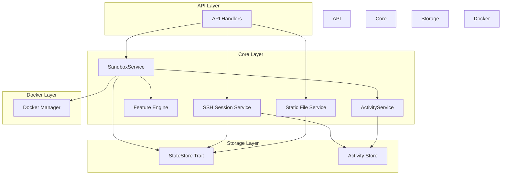

### Module Dependencies

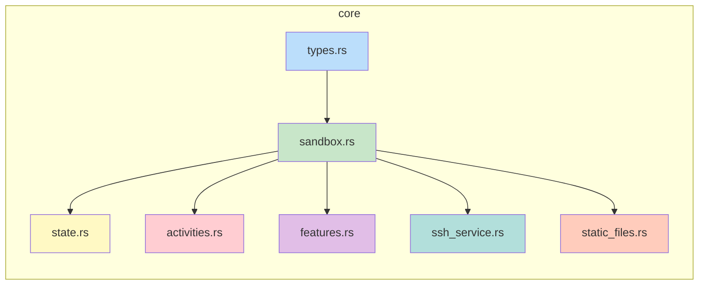

---

## Sandbox Lifecycle

### State Machine

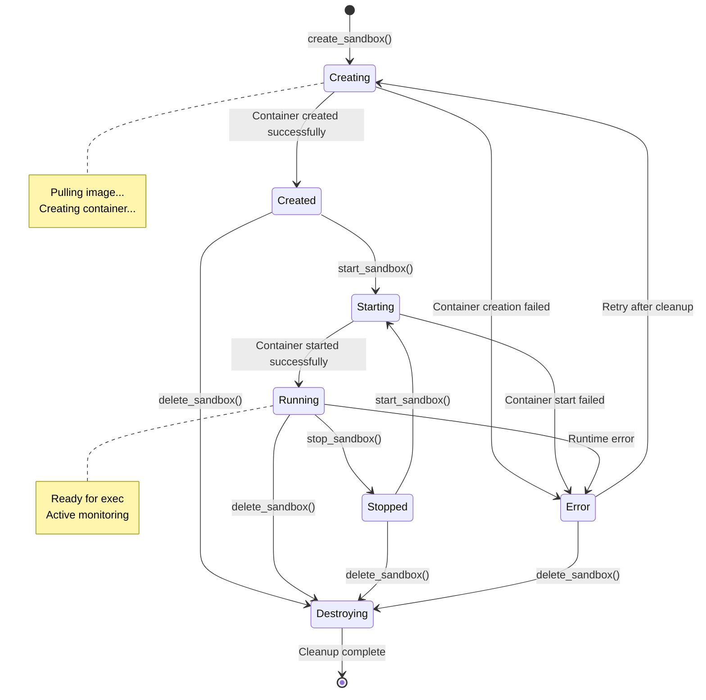

### Lifecycle Flow

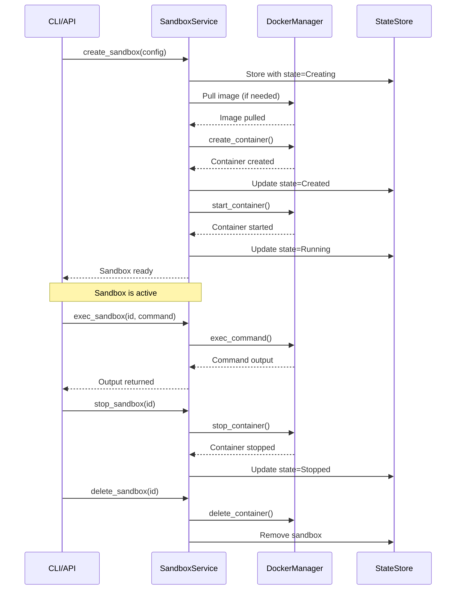

---

## Key Components

### SandboxService

The main orchestrator for sandbox operations.

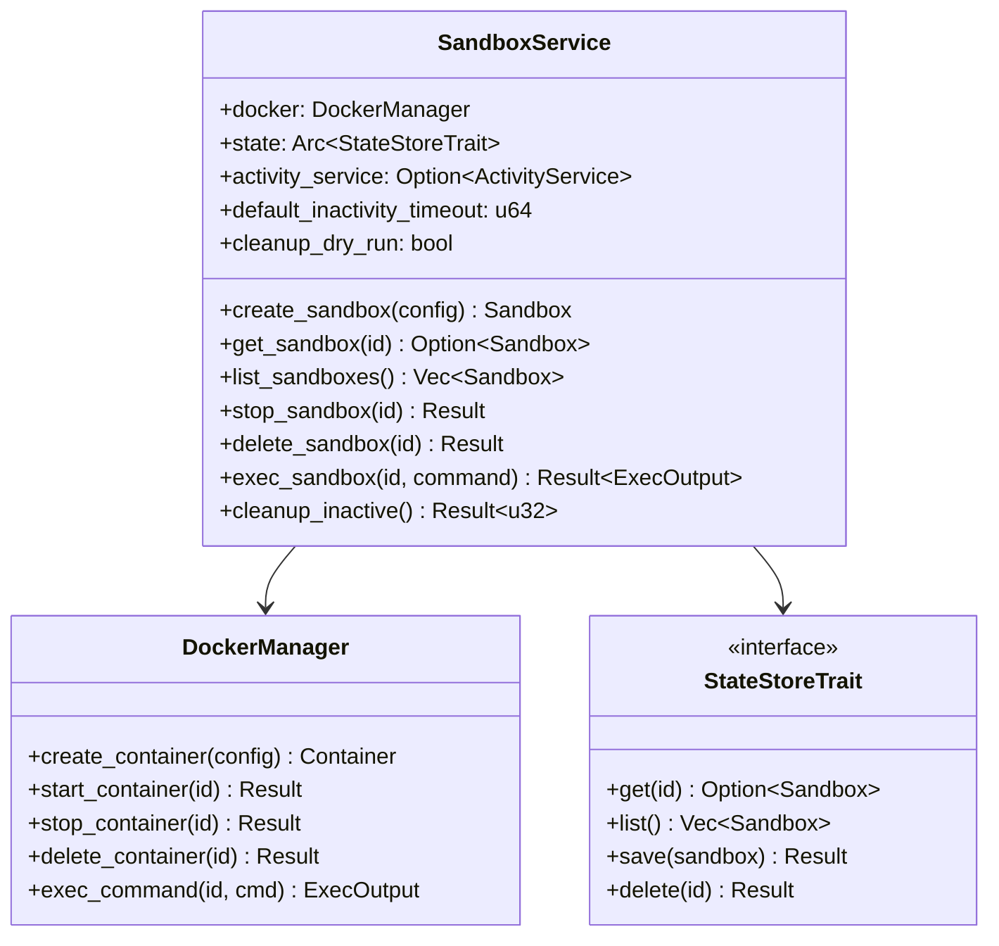

### Key Types

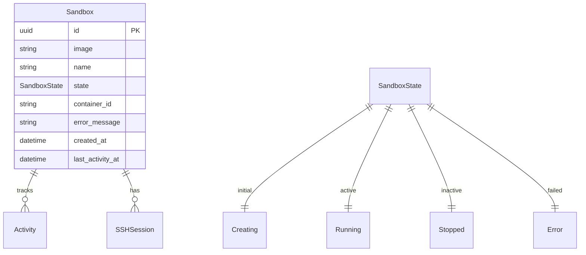

---

## State Management

### StateStore Abstraction

```mermaid
flowchart TB
    subgraph Implementations
        InMemory[InMemoryStateStore]
        Postgres[PostgresStateStore]
    end

    subgraph Consumers
        SandboxService
        SSHService
    end

    subgraph Trait
        StateStoreTrait
    end

    Consumers --> StateStoreTrait
    StateStoreTrait <|-- InMemory
    StateStoreTrait <|-- Postgres

    style StateStoreTrait fill:#bbdefb
    style InMemory fill:#c8e6c9
    style Postgres fill:#c8e6c9
```

### State Transitions

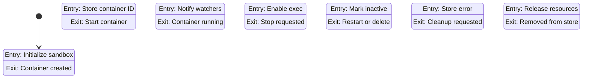

---

## Activity Tracking

### Activity System Architecture

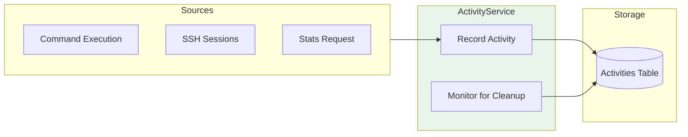

### Activity Types

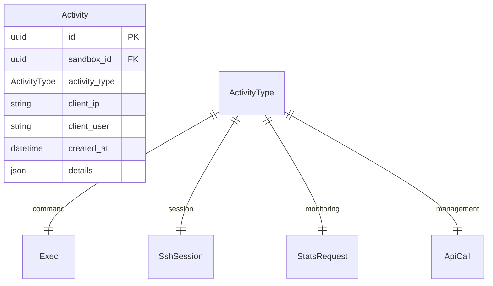

---

## Feature Profiles

### Feature Detection Flow

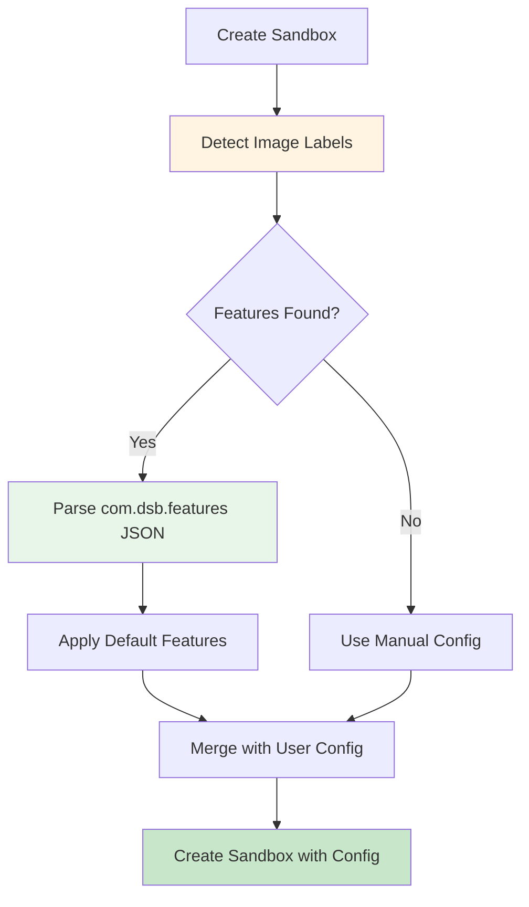

### Feature Schema

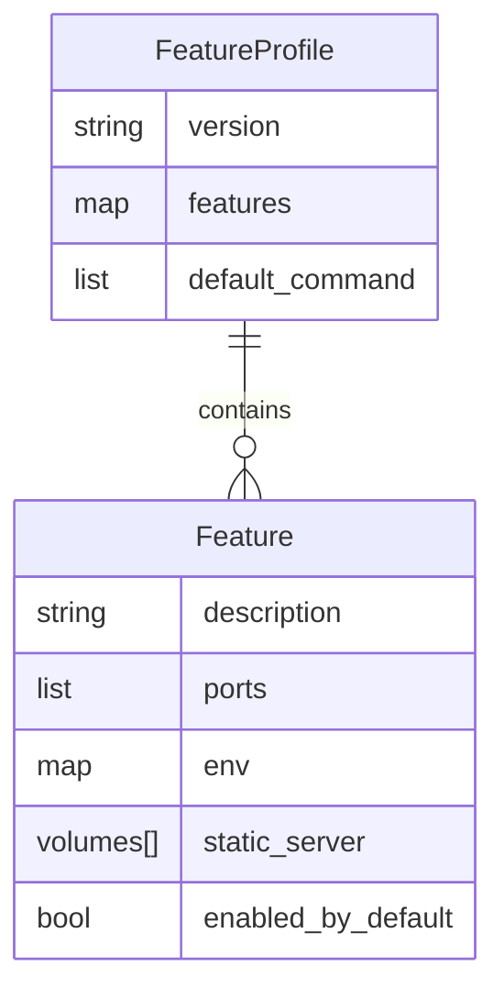

**📚 Comprehensive Guide:** See [Feature Profile System](feature_profiles.md) for complete documentation including:
- Full schema reference with all field types
- Volume types (bind, named, dynamic_bind)
- Static file serving integration
- Complete examples (VNC, web apps, databases)
- Best practices and troubleshooting

---

## SSH Session Management

### SSH Session Lifecycle

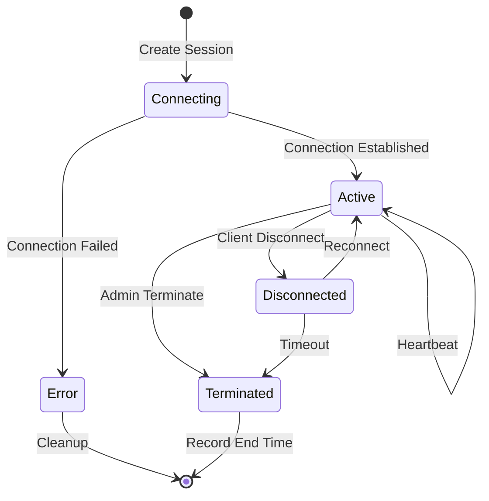

### SSH Session Flow

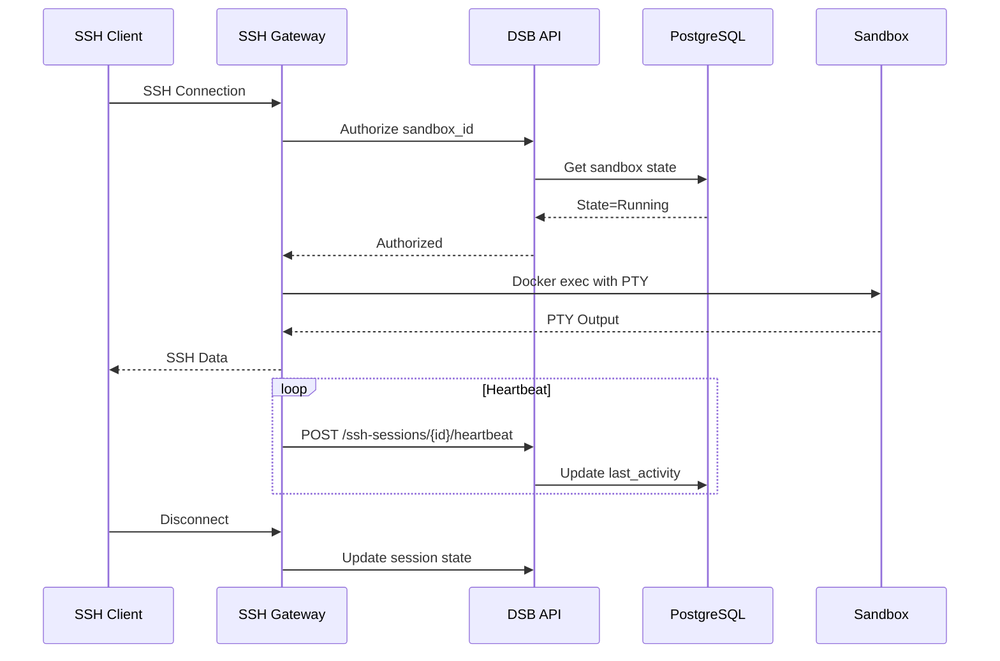

---

## Static Files

### Static File Architecture

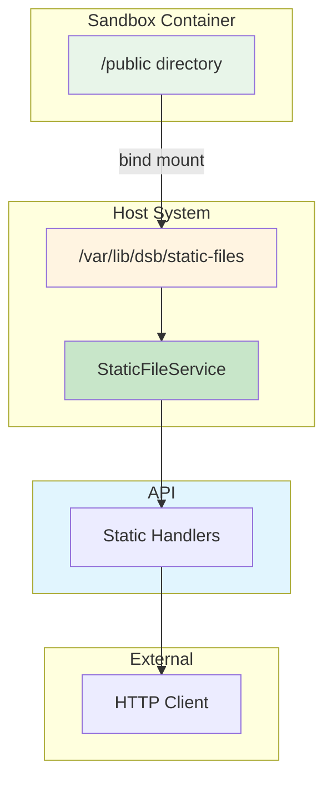

---

## File Structure

```
src/core/
├── mod.rs                    # Module exports and documentation
├── types.rs                  # Core data types (57KB)
│   ├── SandboxState         # Lifecycle states
│   ├── SandboxConfig        # Creation configuration
│   ├── ResourceLimits       # CPU, memory limits
│   ├── PortMapping          # Port bindings
│   ├── Sandbox              # Complete sandbox domain object
│   └── PullPolicy           # Image pull strategies
├── sandbox.rs               # SandboxService (102KB)
│   ├── create_sandbox()     # Create with feature profiles
│   ├── start_sandbox()      # Start container
│   ├── stop_sandbox()       # Stop container
│   ├── delete_sandbox()     # Cleanup resources
│   ├── exec_sandbox()       # Execute commands
│   └── cleanup_inactive()   # Auto-cleanup task
├── state.rs                 # In-memory state store (16KB)
├── store_trait.rs           # StateStore trait abstraction (2.7KB)
├── activities.rs            # ActivityService (13KB)
├── features.rs              # Feature profile system (26KB)
├── ssh_service.rs           # SSH session management (28KB)
└── static_files.rs          # Static file serving (12KB)
```

---

## Relationships

### Module Interaction Map

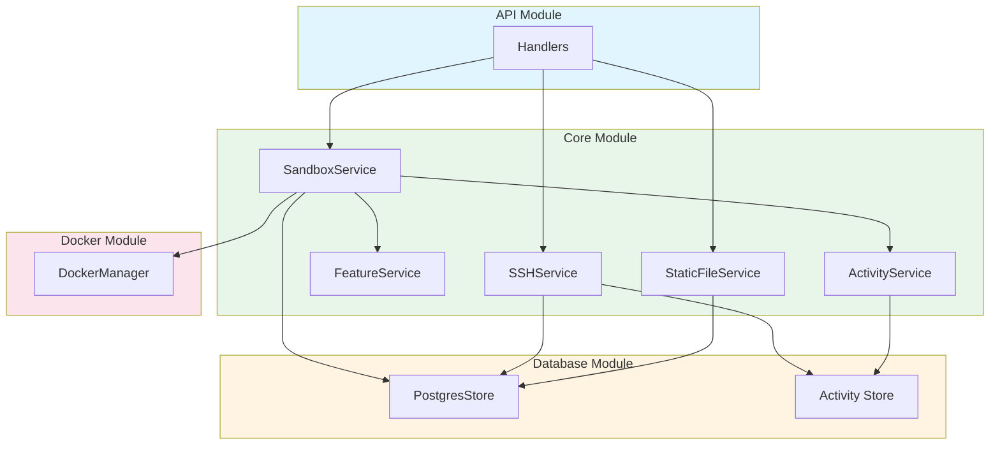

---

## Usage Examples

### Creating a Sandbox

```rust
use dsb::core::{SandboxService, SandboxConfig, SandboxState};
use dsb::docker::DockerManager;
use std::sync::Arc;

let docker = DockerManager::new()?;
let state = Arc::new(StateStore::new());
let service = SandboxService::new(docker, state);

let config = SandboxConfig {
    image: "nginx:alpine".to_string(),
    name: Some("webapp".to_string()),
    ..Default::default()
};

let sandbox = service.create_sandbox(config).await?;
assert_eq!(sandbox.state, SandboxState::Running);
```

### Executing Commands

```rust
let output = service
    .exec_sandbox(
        &sandbox.id,
        vec!["echo".to_string(), "Hello World".to_string()],
    )
    .await?;

println!("Output: {}", output.stdout);
```

---

## See Also

- [Docker Module](../docker/README.md) - Container management
- [API Module](../api/README.md) - REST API handlers
- [Database Module](../db/README.md) - PostgreSQL persistence
- [Static File Serving](../static_serving/STATIC_SERVING.md) - Static file feature
