# Docker Module

The Docker module provides a high-level interface for managing Docker containers using the Bollard library. It handles all container lifecycle operations, PTY-enabled command execution, and feature detection from image labels.

## Table of Contents

1. [Overview](#overview)
2. [Architecture](#architecture)
3. [Key Components](#key-components)
4. [Container Lifecycle](#container-lifecycle)
5. [Command Execution](#command-execution)
6. [Feature Detection](#feature-detection)
7. [Resource Management](#resource-management)
8. [Volume Mounts](#volume-mounts)
9. [File Structure](#file-structure)
10. [Usage Examples](#usage-examples)

---

## Overview

The Docker module provides:

- **Container Management**: Create, start, stop, delete containers
- **Command Execution**: PTY-enabled exec with proper shell wrapping
- **Feature Detection**: Extract feature profiles from image labels
- **Resource Limits**: CPU, memory, and process constraints
- **Volume Management**: Bind mounts and volume configuration
- **Image Pulling**: Flexible pull policies (always, missing, never)

---

## Architecture

### System Architecture

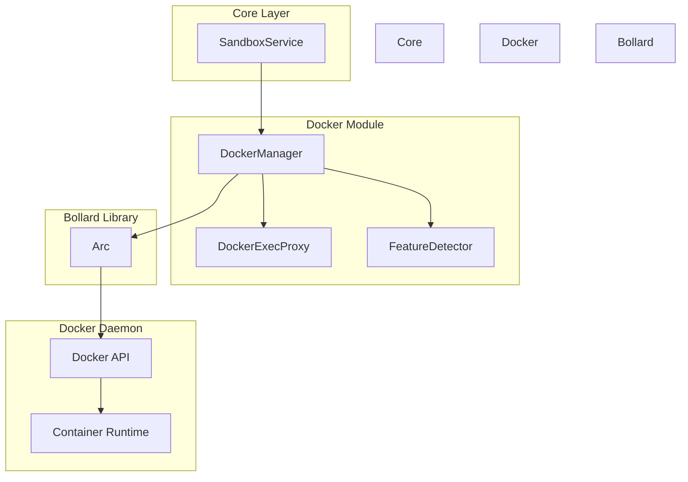

### Connection Architecture

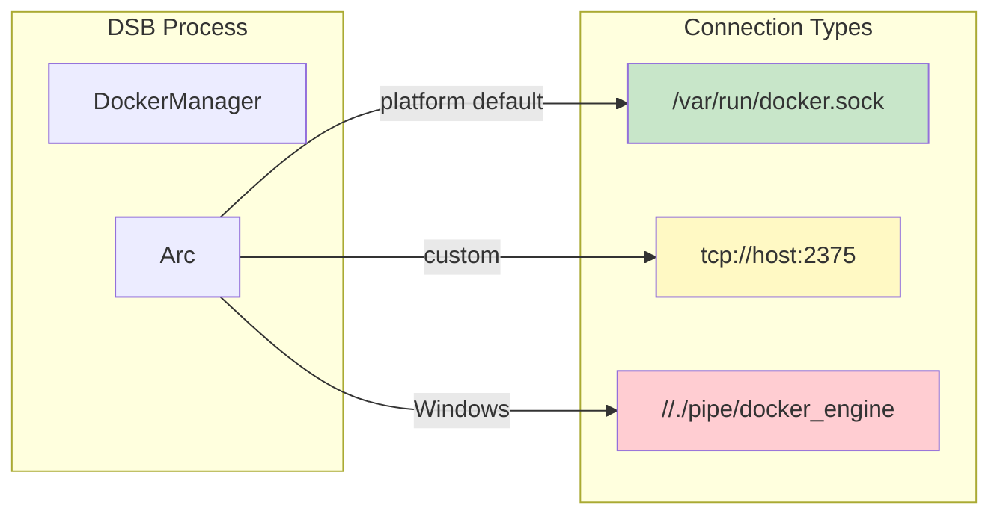

---

## Key Components

### DockerManager

The main interface for Docker operations.

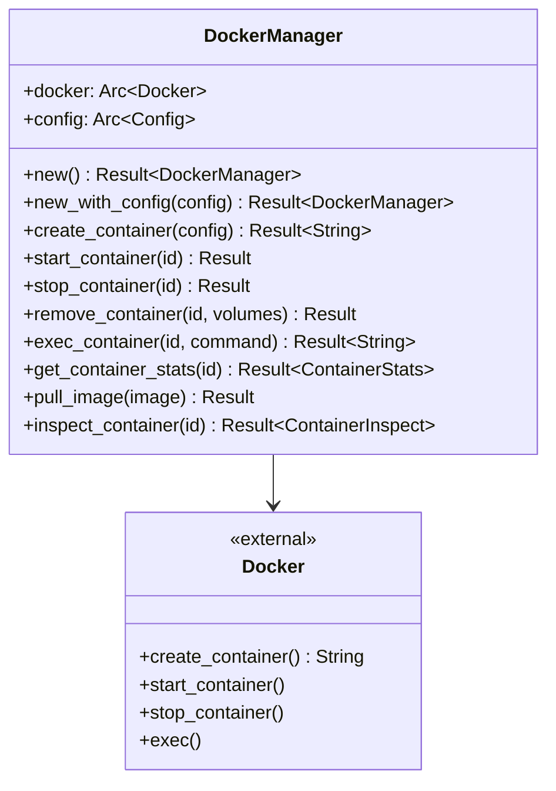

### DockerExecProxy

Handles PTY-enabled command execution.

```mermaid
flowchart TB
    subgraph Exec Flow
        C[Create Exec] --> S[Start Exec]
        S --> Stream[Get I/O Stream]
        Stream --> Resize[Resize PTY]
        Resize --> Close[Close Exec]
    end

    subgraph ExecConfig
        container_id: String
        command: Vec~String~
        working_dir: Option~String~
        env: Option~Vec~String~~
        user: Option~String~
        attach_stdout: bool
        attach_stderr: bool
        tty: bool
    end

    style ExecConfig fill:#e8f5e9
```

### FeatureDetector

Extracts feature profiles from Docker image labels.

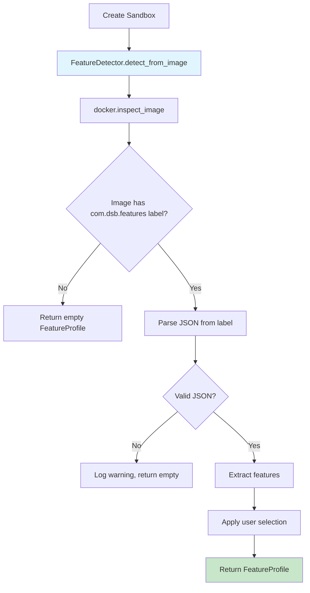

---

## Container Lifecycle

### Lifecycle State Machine

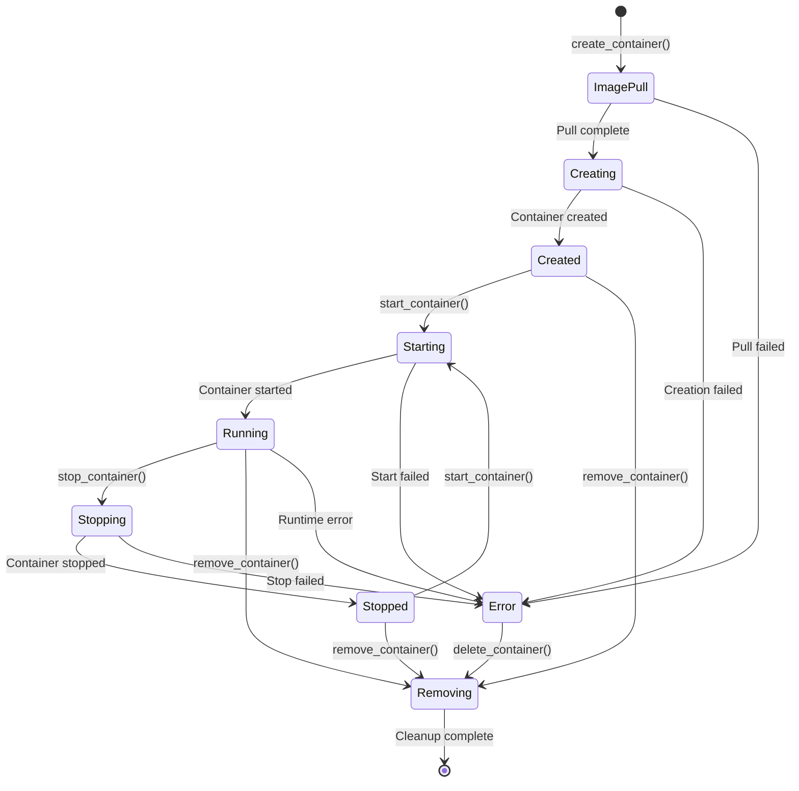

### Container Creation Flow

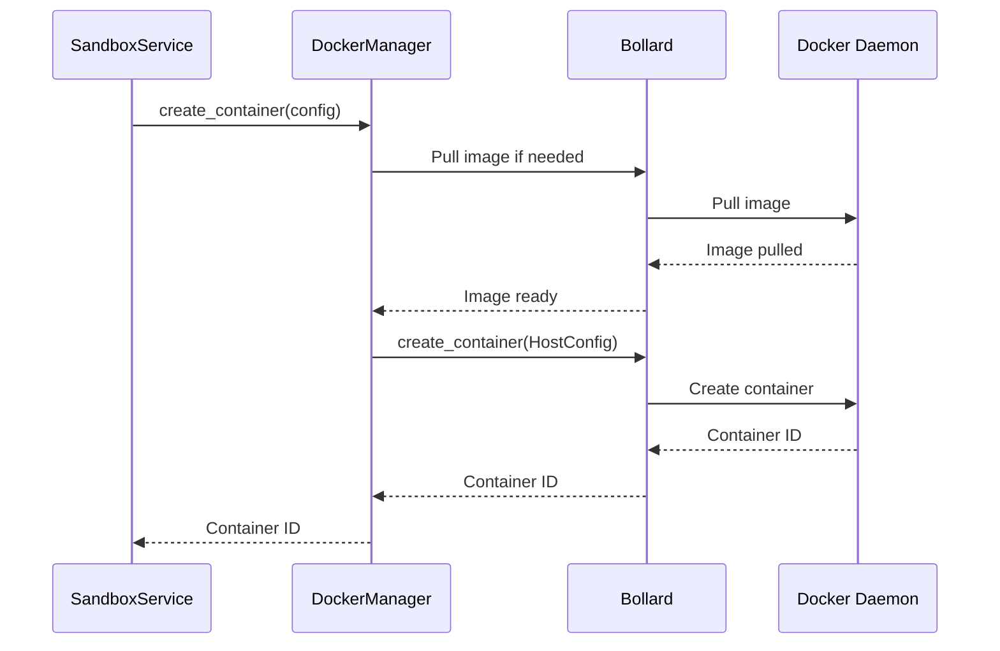

---

## Command Execution

### Exec Flow with PTY

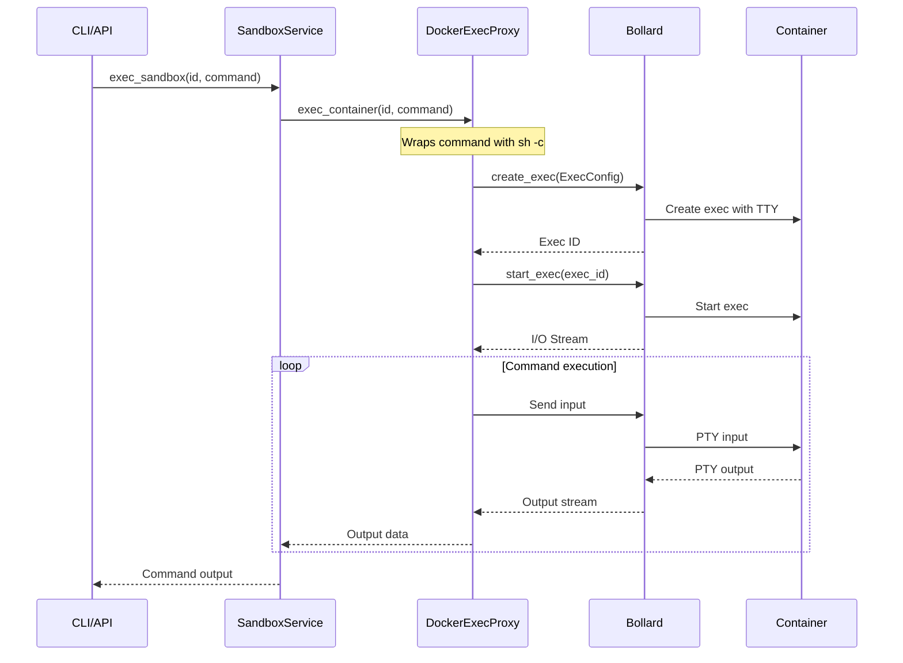

### PTY Window Resizing

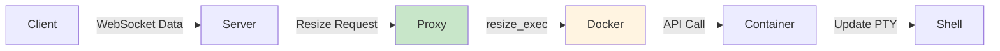

---

## Feature Detection

### Feature Detection Architecture

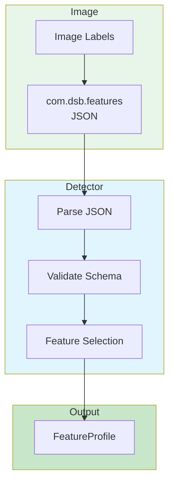

### Feature Label Schema

```json
{
  "version": "1.0",
  "features": {
    "vnc": {
      "description": "VNC server with web client",
      "ports": [
        {"host": 5901, "container": 5901, "protocol": "tcp"}
      ],
      "env": {"DISPLAY": ":1"},
      "enabled_by_default": true
    }
  },
  "default_command": ["sudo", "/usr/bin/supervisord"]
}
```

---

## Resource Management

### Resource Limits Configuration

```mermaid
erDiagram
    ResourceLimits {
        int memory_mb
        int cpu_quota
        int cpu_period
        int cpu_shares
        int pids_limit
        list ulimits
    }

    HostConfig {
        long memory
        int cpu_quota
        int cpu_period
        int cpu_shares
        int pids_limit
        list ulimits
    }

    ResourceLimits --> HostConfig: Maps to
```

### Memory Limit Mapping

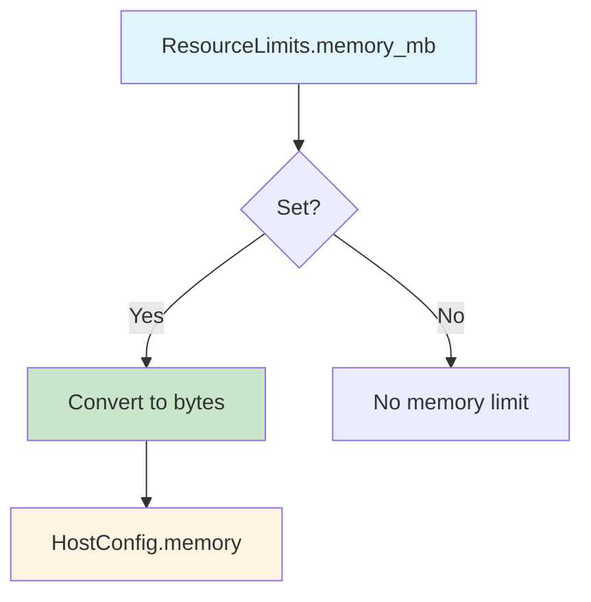

### CPU Limit Mapping

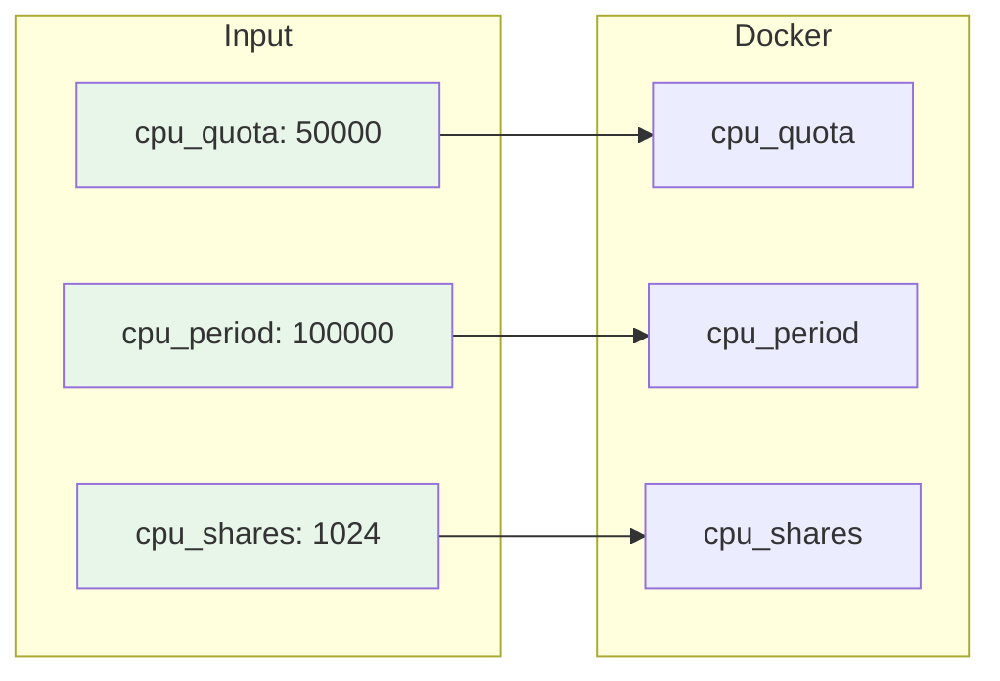

---

## Volume Mounts

### Volume Mount Flow

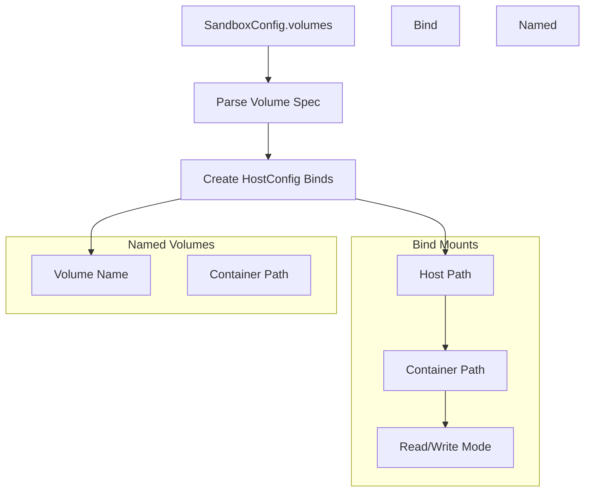

### Mount Format

```text
# Bind mount
host_path:container_path:rw

# Named volume
volume_name:container_path:rw
```

---

## File Structure

```
src/docker/
├── mod.rs                    # Module exports
├── manager.rs                # DockerManager (70KB)
│   ├── new()                 # Create manager
│   ├── new_with_config()     # Create with custom config
│   ├── create_container()    # Create with full config
│   ├── start_container()     # Start container
│   ├── stop_container()      # Stop with timeout
│   ├── remove_container()    # Delete with volumes
│   ├── exec_container()      # Execute command
│   ├── get_container_stats() # Get resource stats
│   ├── pull_image()          # Pull image manually
│   └── inspect_container()   # Get container details
├── exec_proxy.rs             # DockerExecProxy (23KB)
│   ├── ExecConfig            # Exec configuration
│   ├── create_exec_pty()     # Create with PTY
│   ├── start_exec()          # Start and get stream
│   ├── resize_exec()         # Resize PTY window
│   └── exec_stream()         # Stream I/O
├── docker_trait.rs           # DockerTrait (5.2KB)
│   └── DockerTrait           # Trait for mocking
└── features.rs               # Feature detection (13KB)
    ├── FeatureDetector       # Inspect image labels
    ├── detect_from_image()   # Get feature profile
    └── determine_enabled_features()
```

---

## Usage Examples

### Creating a Container

```rust
use dsb::docker::DockerManager;
use dsb::core::types::{SandboxConfig, PortMapping, PortProtocol};

let docker = DockerManager::new()?;

let config = SandboxConfig {
    image: "nginx:alpine".to_string(),
    name: Some("web".to_string()),
    port_mappings: vec![
        PortMapping {
            host_port: 8080,
            container_port: 80,
            protocol: PortProtocol::Tcp,
        }
    ],
    ..Default::default()
};

let container_id = docker.create_container(&config).await?;
docker.start_container(&container_id).await?;
```

### Executing Commands

```rust
let output = docker.exec_container(
    &container_id,
    vec!["ls".to_string(), "-la".to_string()]
).await?;

println!("Output: {}", output);
```

### Pulling Images with Policy

```rust
use dsb::core::types::PullPolicy;

match PullPolicy::Always {
    PullPolicy::Always => docker.pull_image(&image).await?,
    PullPolicy::Missing => {
        if !docker.image_exists(&image).await? {
            docker.pull_image(&image).await?;
        }
    }
    PullPolicy::Never => { /* Skip pull */ }
}
```

---

## See Also

- [Core Module](../core/README.md) - Sandbox orchestration
- [API Module](../api/README.md) - REST API handlers
- [Config Module](../config/README.md) - Configuration management
