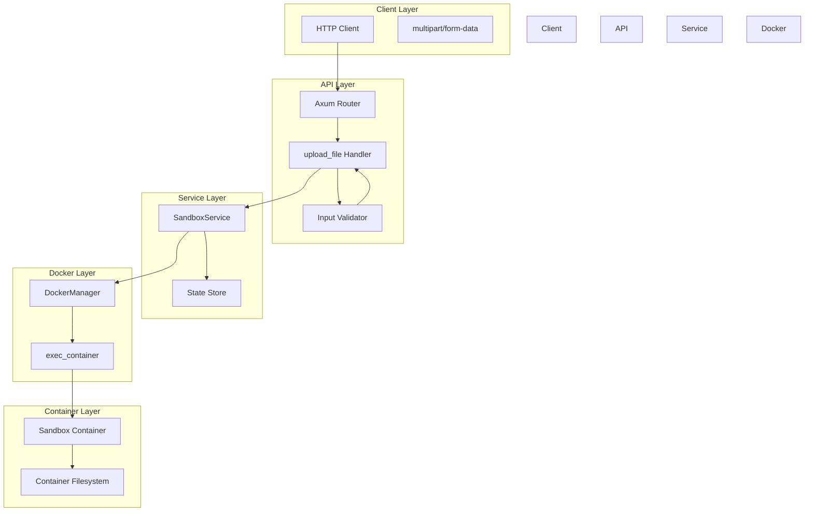
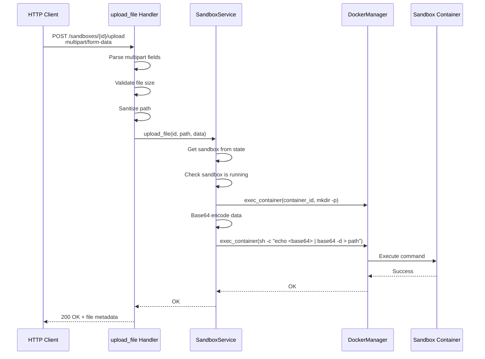

# File Upload Implementation

This document provides detailed technical documentation of the file upload API implementation in DSB, including architecture, design decisions, and code flow.

## Table of Contents

1. [Overview](#overview)
2. [Architecture](#architecture)
3. [Design Decisions](#design-decisions)
4. [Implementation Details](#implementation-details)
5. [Security Considerations](#security-considerations)
6. [Error Handling](#error-handling)
7. [Performance Considerations](#performance-considerations)
8. [Testing Strategy](#testing-strategy)

---

## Overview

The file upload API allows users to upload files directly into sandbox container filesystems using HTTP multipart/form-data requests. Files are written directly to containers via Docker exec with base64 encoding for safe data transmission.

### Key Features

- **Multipart/Form-Data**: Browser-compatible file upload format
- **Direct Container Storage**: Files written directly to container filesystem
- **Security**: Path sanitization, file size limits (10MB), input validation
- **In-Memory Processing**: No temporary files on host (for files <10MB)
- **Base64 Encoding**: Safe transmission of binary data via shell commands

---

## Architecture

### System Components



### Request Flow



---

## Design Decisions

### 1. Multipart/Form-Data Format

**Decision**: Use `multipart/form-data` instead of raw bytes or JSON encoding.

**Rationale**:
- Browser-compatible out of the box
- Supports both file and text fields in same request
- Industry standard for file uploads
- Well-supported by HTTP clients (curl, Postman, browsers)

**Trade-offs**:
- More complex parsing than raw bytes
- Slightly larger request size due to boundaries

### 2. Direct Container Storage

**Decision**: Write files directly to container filesystem instead of host storage.

**Rationale**:
- Simpler architecture - no need for intermediate storage
- Files persist only for container lifetime (automatic cleanup)
- No host filesystem pollution
- Better isolation and security

**Trade-offs**:
- Requires container to be running
- Files lost when container is deleted
- Slightly more complex implementation (Docker exec)

### 3. Base64 Encoding

**Decision**: Use base64 encoding to transmit file data through shell commands.

**Rationale**:
- Safe transmission of binary data
- No special character escaping issues
- Shell-compatible approach
- Prevents command injection

**Trade-offs**:
- 33% size overhead during transmission
- Encoding/decoding CPU overhead (acceptable for <10MB files)

### 4. In-Memory Processing

**Decision**: Load entire file into memory instead of streaming.

**Rationale**:
- Simpler implementation
- Acceptable for files <10MB
- No temporary file cleanup needed
- Faster for small files

**Trade-offs**:
- Not scalable for large files
- Memory usage scales with file size
- Future enhancement: streaming for >10MB files

### 5. Path Sanitization Strategy

**Decision**: Remove ".." sequences and clean up resulting double slashes.

**Rationale**:
- Prevents directory traversal attacks
- Maintains usability (sanitized paths still valid)
- Simple and predictable behavior
- No ambiguity for users

**Trade-offs**:
- Changes user's intended path (e.g., `/etc/../app` → `/etc/app`)
- Could block legitimate use cases (rare for sandboxes)

---

## Implementation Details

### File: `src/api/handlers/sandbox.rs`

#### Handler Function

```rust
pub async fn upload_file(
    State(service): State<Arc<SandboxService>>,
    Path(id): Path<uuid::Uuid>,
    mut multipart: Multipart,
) -> Response
```

**Key Responsibilities**:
1. Extract multipart fields (`path` and `file`)
2. Validate file size (<10MB)
3. Sanitize destination path
4. Call service layer to write to container
5. Return success response with file metadata

**Implementation Highlights**:
```rust
const MAX_FILE_SIZE: u64 = 10 * 1024 * 1024; // 10MB

// Process multipart fields
while let Some(field) = multipart.next_field().await.unwrap_or(None) {
    match field.name().unwrap_or("").as_str() {
        "path" => { /* Extract destination path */ }
        "file" => {
            // Validate size BEFORE loading entire file
            if data.len() as u64 > MAX_FILE_SIZE {
                return error_response(400, "File too large");
            }
        }
    }
}
```

#### Helper Functions

**Path Sanitization**:
```rust
fn sanitize_path(path: &str) -> Result<String, Error> {
    // Remove ".." sequences
    let sanitized = path.replace("..", "").replace("//", "/");

    // Ensure absolute path
    let path = if sanitized.starts_with('/') {
        sanitized
    } else {
        format!("/{}", sanitized)
    };

    // Validate no dangerous patterns
    if path.contains("//") || path.contains('\\') {
        return Err("Invalid path");
    }

    Ok(path)
}
```

**Filename Extraction**:
```rust
fn extract_filename(path: &str) -> String {
    std::path::Path::new(path)
        .file_name()
        .and_then(|n| n.to_str())
        .unwrap_or("uploaded_file")
        .to_string()
}
```

### File: `src/core/sandbox.rs`

#### Service Layer Method

```rust
pub async fn upload_file(
    &self,
    id: &uuid::Uuid,
    dest_path: &str,
    data: Vec<u8>,
) -> Result<(), Box<dyn std::error::Error + Send + Sync>>
```

**Key Responsibilities**:
1. Verify sandbox exists and is running
2. Create parent directories if needed
3. Base64-encode file data
4. Execute shell command to write file
5. Return success or error

**Implementation Flow**:
```rust
use base64::prelude::*;

// 1. Get sandbox
let sandbox = self.state.get_sandbox(id).await?
    .ok_or("Sandbox not found")?;

// 2. Check state
if sandbox.state != SandboxState::Running {
    return Err("Sandbox is not running".into());
}

// 3. Create parent directory
if let Some(parent) = std::path::Path::new(dest_path).parent() {
    let dest_dir = parent.to_str().unwrap_or("/");
    let mkdir_cmd = vec!["mkdir", "-p", dest_dir];
    let _ = self.docker.exec_container(container_id, mkdir_cmd).await;
}

// 4. Encode and write file
let encoded = BASE64_STANDARD.encode(&data);
let write_cmd = vec![
    "sh", "-c",
    format!("echo '{}' | base64 -d > '{}'", encoded, dest_path)
];

self.docker.exec_container(container_id, write_cmd).await?;
```

### Data Structures

#### Request Types

```rust
// No dedicated request struct - multipart data extracted directly
// Multipart fields:
// - path: String (destination path in container)
// - file: Vec<u8> (file contents)
```

#### Response Types

```rust
#[derive(Debug, Serialize, Deserialize)]
pub struct FileInfo {
    pub name: String,           // Original filename
    pub path: String,           // Sanitized path
    pub size: u64,              // File size in bytes
    pub uploaded_at: DateTime<Utc>,  // Timestamp
}

#[derive(Debug, Serialize, Deserialize)]
pub struct UploadFileResponse {
    pub success: bool,
    pub file: FileInfo,
}
```

### Router Configuration

**File**: `src/api/server/mod.rs`

```rust
let app = Router::new()
    // ... other routes ...
    .route("/sandboxes/{id}/upload", post(upload_file))  // NEW
    // ... other routes ...
    .with_state(service);
```

---

## Security Considerations

### 1. Path Traversal Prevention

**Threat**: Malicious paths like `/etc/../root/.ssh` to escape container.

**Mitigation**:
```rust
// Remove ".." sequences
let sanitized = path.replace("..", "").replace("//", "/");

// Example: "/etc/../root/.ssh" → "/etc/root/.ssh"
```

**Testing**:
```bash
# Test path traversal
curl -X POST "http://localhost:8080/sandboxes/{id}/upload" \
  -F "path=/etc/../tmp/safe.txt" \
  -F "file=@test.txt"

# Result: Uploads to /etc/tmp/safe.txt (sanitized)
```

### 2. File Size Limits

**Threat**: Large files causing memory exhaustion or disk filling.

**Mitigation**:
```rust
const MAX_FILE_SIZE: u64 = 10 * 1024 * 1024; // 10MB

// Check size BEFORE processing
if data.len() as u64 > MAX_FILE_SIZE {
    return error_response(400, "File too large");
}
```

**Testing**:
```bash
# Test oversized file
dd if=/dev/zero of=large.bin bs=1M count=11
curl -X POST "http://localhost:8080/sandboxes/{id}/upload" \
  -F "path=/tmp/large.bin" -F "file=@large.bin"

# Result: 400 Bad Request "File size exceeds limit"
```

### 3. Input Validation

**Threat**: Missing required fields causing crashes.

**Mitigation**:
```rust
// Validate required fields present
let dest_path = match dest_path {
    Some(path) => path,
    None => return error_response(400, "Missing 'path' field"),
};

let file_data = match file_data {
    Some(data) => data,
    None => return error_response(400, "Missing 'file' field"),
};
```

### 4. Container State Validation

**Threat**: Writing to stopped/non-existent containers.

**Mitigation**:
```rust
// Check sandbox exists
let sandbox = self.state.get_sandbox(id).await?
    .ok_or("Sandbox not found")?;

// Check sandbox is running
if sandbox.state != SandboxState::Running {
    return Err("Sandbox is not running".into());
}
```

### 5. Command Injection Prevention

**Threat**: Malicious filenames or paths containing shell metacharacters.

**Mitigation**:
```rust
// Base64 encoding prevents shell injection
let encoded = BASE64_STANDARD.encode(&data);
let write_cmd = vec![
    "sh", "-c",
    // Single quotes prevent variable expansion
    format!("echo '{}' | base64 -d > '{}'", encoded, dest_path)
];
```

---

## Error Handling

### Error Response Format

All errors return JSON with consistent format:

```json
{
  "error": "Error message",
  "hint": "Optional helpful hint"
}
```

### HTTP Status Codes

| Status | Scenario | Example |
|--------|----------|---------|
| 200 OK | Upload successful | File uploaded and verified |
| 400 Bad Request | Invalid input | Missing fields, path contains dangerous characters |
| 404 Not Found | Sandbox doesn't exist | Invalid sandbox ID |
| 409 Conflict | Sandbox not running | Can't write to stopped container |
| 500 Internal Error | Container write failure | Docker exec failed |

### Error Classification

```rust
let error_msg = e.to_string();

if error_msg.contains("not found") {
    (StatusCode::NOT_FOUND, json!({"error": "Sandbox not found"}))
} else if error_msg.contains("not running") {
    (StatusCode::CONFLICT, json!({"error": "Sandbox is not running"}))
} else {
    (StatusCode::INTERNAL_SERVER_ERROR,
     json!({"error": format!("Upload failed: {}", error_msg)}))
}
```

---

## Performance Considerations

### Current Implementation (Files <10MB)

**Characteristics**:
- Entire file loaded into memory
- Base64 encoding adds 33% overhead
- Single Docker exec call for mkdir
- Single Docker exec call for write

**Performance**:
- Memory usage: O(file size)
- CPU usage: O(file size) for base64
- Network: O(file size)
- Latency: ~50-100ms for 1MB file

### Optimization Opportunities

**For Larger Files (>10MB)**:
1. **Streaming**: Process file in chunks
2. **Chunked Upload**: Resumable uploads
3. **Direct Docker API**: Use tar archive injection
4. **Parallel Processing**: Upload multiple files concurrently

**Example Future Implementation**:
```rust
// Streaming approach for large files
async fn upload_large_file(
    mut field: Field<'_>,
    dest_path: PathBuf,
) -> Result<(), Error> {
    let mut file = tokio::fs::File::create(&dest_path).await?;

    while let Some(chunk) = field.next_chunk().await? {
        file.write_all(&chunk).await?;
    }

    Ok(())
}
```

---

## Testing Strategy

### Unit Tests

**Location**: `src/api/handlers/sandbox.rs`

```rust
#[cfg(test)]
mod tests {
    // Path sanitization tests
    #[test]
    fn test_sanitize_path_removes_double_dots() {
        let path = "/etc/../app/data.txt";
        let sanitized = sanitize_path(path).unwrap();
        assert_eq!(sanitized, "/etc/app/data.txt");
        assert!(!sanitized.contains(".."));
    }

    #[test]
    fn test_sanitize_path_absolute_path() {
        let path = "app/data.txt";
        let sanitized = sanitize_path(path).unwrap();
        assert!(sanitized.starts_with('/'));
        assert_eq!(sanitized, "/app/data.txt");
    }

    // Filename extraction tests
    #[test]
    fn test_extract_filename() {
        assert_eq!(extract_filename("/app/config.json"), "config.json");
        assert_eq!(extract_filename("/app/data/"), "data");
    }

    // Serialization tests
    #[test]
    fn test_upload_file_response_serialization() {
        let response = UploadFileResponse {
            success: true,
            file: FileInfo {
                name: "test.txt".to_string(),
                path: "/app/test.txt".to_string(),
                size: 1024,
                uploaded_at: chrono::Utc::now(),
            },
        };

        let json = serde_json::to_string(&response).unwrap();
        let deserialized: UploadFileResponse = serde_json::from_str(&json).unwrap();
        assert!(deserialized.success);
    }
}
```

### Integration Tests

**Manual Testing Commands**:
```bash
# 1. Create sandbox
SANDBOX_ID=$(dsb create --image alpine:latest --json | jq -r '.id')

# 2. Upload file
echo "Hello, World!" > test.txt
curl -X POST "http://localhost:8080/sandboxes/$SANDBOX_ID/upload" \
  -F "path=/tmp/test.txt" \
  -F "file=@test.txt"

# 3. Verify file in container
dsb exec $SANDBOX_ID cat /tmp/test.txt

# 4. Test path traversal
curl -X POST "http://localhost:8080/sandboxes/$SANDBOX_ID/upload" \
  -F "path=/etc/../tmp/safe.txt" \
  -F "file=@test.txt"

# 5. Test missing fields
curl -X POST "http://localhost:8080/sandboxes/$SANDBOX_ID/upload" \
  -F "file=@test.txt"
```

### Test Coverage

- ✅ Path sanitization (4 tests)
- ✅ Filename extraction (1 test)
- ✅ Response serialization (2 tests)
- ✅ Manual integration testing
- ⏳ Automated integration tests (future)

---

## Dependencies

### Required Crates

```toml
[dependencies]
axum = { version = "0.8", features = ["multipart"] }
base64 = "0.22"
tokio = { version = "1.48", features = ["full"] }
serde = { version = "1.0", features = ["derive"] }
```

### Why These Dependencies?

1. **axum-multipart**: Multipart form data parsing
2. **base64**: Safe binary data encoding
3. **tokio**: Async runtime
4. **serde**: JSON serialization

---

## Future Enhancements

### 1. Chunked Upload for Large Files

Support files >10MB with chunked upload:

```bash
# Upload in chunks
curl -X POST "/sandboxes/{id}/upload/chunk" \
  -F "chunk_number=0" \
  -F "total_chunks=10" \
  -F "file=@chunk1.bin"

curl -X POST "/sandboxes/{id}/upload/chunk" \
  -F "chunk_number=1" \
  -F "total_chunks=10" \
  -F "file=@chunk2.bin"
```

### 2. Multiple File Upload

Support uploading multiple files in one request:

```bash
curl -X POST "/sandboxes/{id}/upload/multiple" \
  -F "files=@file1.txt" \
  -F "files=@file2.txt" \
  -F "files=@file3.txt"
```

### 3. Progress Streaming

Stream upload progress for large files:

```javascript
const response = await fetch('/sandboxes/{id}/upload', {
  method: 'POST',
  body: formData,
});

const reader = response.body.getReader();
while (true) {
  const {done, value} = await reader.read();
  if (done) break;
  console.log('Progress:', new TextDecoder().decode(value));
}
```

### 4. File Type Validation

Validate file types by magic bytes:

```rust
const ALLOWED_TYPES: &[&str] = &[
    "text/plain",
    "application/json",
    "image/png",
];

fn validate_file_type(data: &[u8]) -> Result<(), Error> {
    let mime_type = detect_mime_type(data);
    if !ALLOWED_TYPES.contains(&mime_type) {
        return Err(format!("File type not allowed: {}", mime_type).into());
    }
    Ok(())
}
```

---

## See Also

- [API Documentation](../api/README.md) - REST API reference
- [Core Module](../core/README.md) - Sandbox service architecture
- [Docker Module](../docker/README.md) - Container management
- [Static File Serving](../static_serving/STATIC_SERVING.md) - File serving endpoints
