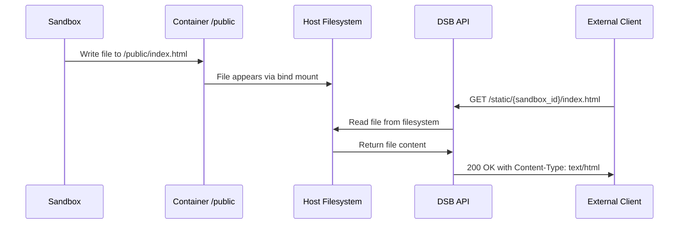
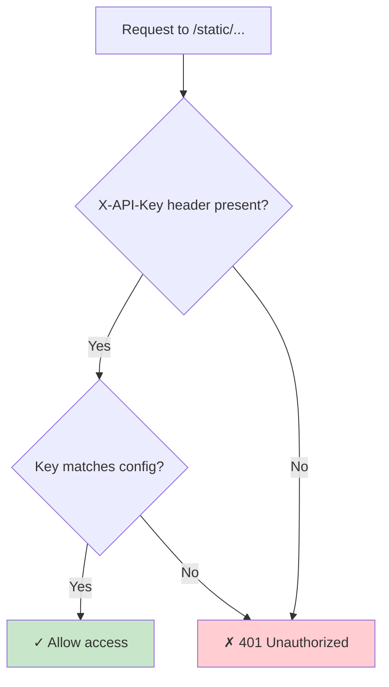
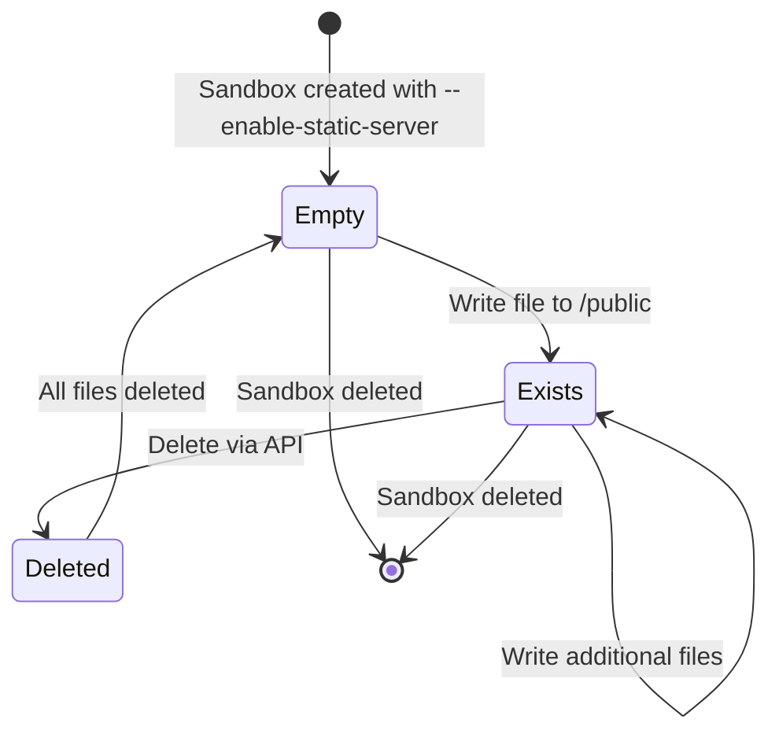
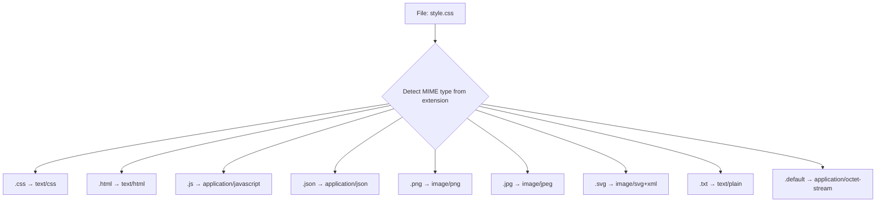
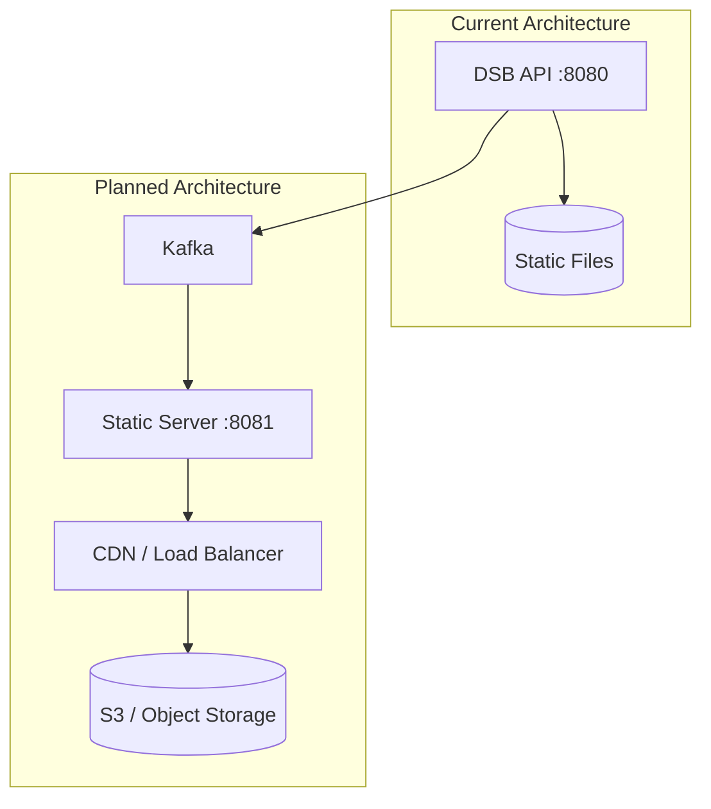

# Static File Serving

A comprehensive guide to DSB's static file serving feature, which enables sandboxes to serve static files through a shared volume mount with HTTP API access.

## Table of Contents

1. [Overview](#overview)
2. [Architecture](#architecture)
3. [Quick Start](#quick-start)
4. [Configuration](#configuration)
5. [CLI Usage](#cli-usage)
6. [API Reference](#api-reference)
7. [Security](#security)
8. [Cache Control](#cache-control)
9. [Python SDK](#python-sdk)
10. [File Operations](#file-operations)
11. [Limitations](#limitations)
12. [Troubleshooting](#troubleshooting)

---

## Overview

The static file serving feature allows Docker sandbox containers to share static files with the host system and external clients via HTTP API endpoints. When enabled, a bind mount is created between the host's static files directory and the container's `/public` directory.

### Key Capabilities

- **Volume Sharing**: Files written to `/public` in the container are immediately accessible on the host
- **HTTP Access**: Serve files via REST API endpoints with proper MIME type detection
- **Cache Control**: Per-MIME-type cache control configuration
- **Authentication**: API key protection for all static file endpoints
- **File Management**: List, read, and delete files through the API

---

## Architecture

### System Architecture

```mermaid
flowchart TB
    subgraph DSB System
        API[DSB API Server<br/>:8080] --> StaticService[Static File Service]
        StaticService --> FileSystem[Host Filesystem<br/>/var/lib/dsb/static-files]
    end

    subgraph Docker Host
        subgraph Sandbox Container
            PublicDir["/public directory"]
        end
    end

    FileSystem -->|bind mount| PublicDir

    External[External Client] -->|HTTP GET /static/{id}/{path}| API
    API -->|returns file content| External

    style API fill:#e1f5ff
    style FileSystem fill:#fff4e1
    style Sandbox Container fill:#e8f5e9
    style External fill:#fce4ec
```

### File Flow



### Data Flow During Sandbox Creation

```mermaid
flowchart LR
    A[CLI: dsb create<br/>--enable-static-server] --> B[Sandbox Service]
    B --> C[Docker Manager]
    C --> D[Create Container<br/>with bind mount]
    D --> E[Host: /var/lib/dsb/static-files/{id}<br/>Container: /public]

    style A fill:#e1f5ff
    style B fill:#fff4e1
    style C fill:#e8f5e9
    style D fill:#fce4ec
    style E fill:#c8e6c9
```

---

## Quick Start

### 1. Enable Static Server When Creating a Sandbox

```bash
# Using CLI
dsb create --image nginx:alpine --enable-static-server -n webapp

# Files written to /public in container appear on host
```

### 2. Write Files from Inside the Sandbox

```bash
# Connect to sandbox and write files
dsb exec <sandbox-id> bash -c 'echo "<h1>Hello World</h1>" > /public/index.html'
```

### 3. Access Files via API

```bash
# List files
curl http://localhost:8080/static/files/<sandbox-id> \
  -H "X-API-Key: your-api-key"

# Serve file
curl http://localhost:8080/static/<sandbox-id>/index.html \
  -H "X-API-Key: your-api-key"
```

---

## Configuration

### Configuration File (dsb.yaml)

```yaml
static_server:
  base_path: "/var/lib/dsb/static-files"   # Host directory for static files
  api_key: null                             # Optional: overrides server.api_key
  require_auth: false                       # Require API key for static file access
  max_file_size_mb: 100                     # Maximum file size in MB
  enable_directory_browsing: false          # Security: disable directory listing
  cache_control: "public, max-age=3600"     # Default cache header
  cache_control_by_type:                    # Per-MIME-type overrides
    "text/html": "no-cache"
    "image/*": "public, max-age=86400"
    "application/javascript": "public, max-age=1800"
```

### Environment Variables

```bash
export DSB_STATIC_SERVER__BASE_PATH="/var/lib/dsb/static-files"
export DSB_STATIC_SERVER__API_KEY="your-secret-key"
export DSB_STATIC_SERVER__REQUIRE_AUTH=false
export DSB_STATIC_SERVER__MAX_FILE_SIZE_MB=100
export DSB_STATIC_SERVER__ENABLE_DIRECTORY_BROWSING=false
export DSB_STATIC_SERVER__CACHE_CONTROL="public, max-age=3600"
```

### Configuration Reference

| Setting | Env Variable | Default | Description |
|---------|--------------|---------|-------------|
| `base_path` | `DSB_STATIC_SERVER__BASE_PATH` | `/var/lib/dsb/static-files` | Host directory for static files |
| `api_key` | `DSB_STATIC_SERVER__API_KEY` | `null` | API key for authentication |
| `require_auth` | `DSB_STATIC_SERVER__REQUIRE_AUTH` | `false` | Require API key for static file access |
| `max_file_size_mb` | `DSB_STATIC_SERVER__MAX_FILE_SIZE_MB` | `100` | Maximum file size in megabytes |
| `enable_directory_browsing` | `DSB_STATIC_SERVER__ENABLE_DIRECTORY_BROWSING` | `false` | Enable directory listing |
| `cache_control` | `DSB_STATIC_SERVER__CACHE_CONTROL` | `public, max-age=3600` | Default cache header value |
| `cache_control_by_type` | N/A | `{}` | MIME-type specific cache rules |

---

## CLI Usage

### Creating a Sandbox with Static Server

```bash
# Basic usage
dsb create --image nginx:alpine --enable-static-server -n webapp

# With custom inactivity timeout
dsb create --image python:3.12 --enable-static-server -t 30 -n data-app

# With resource limits
dsb create --image node:20 --enable-static-server -c 512 -m 1024 -n node-app
```

### Exec into Sandbox to Manage Files

```bash
# Write files
dsb exec <sandbox-id> bash -c 'echo "Hello" > /public/index.html'

# Create subdirectories
dsb exec <sandbox-id> bash -c 'mkdir -p /public/css /public/js'

# Write multiple files
dsb exec <sandbox-id> bash -c 'cat > /public/style.css <<EOF
body { font-family: sans-serif; }
EOF'

# List files in /public
dsb exec <sandbox-id> ls -la /public/
```

---

## API Reference

### Base URL

```
http://localhost:8080/static
```

### Authentication

All static file endpoints require the `X-API-Key` header:

```bash
curl http://localhost:8080/static/files/<sandbox-id> \
  -H "X-API-Key: your-api-key"
```

> **Note**: If no API key is configured, endpoints are publicly accessible.

### Endpoints

#### 1. Serve Static File

```http
GET /static/{sandbox_id}/{file_path}
```

Serves a static file from the sandbox's public directory.

**Parameters:**

| Parameter | Type | Description |
|-----------|------|-------------|
| `sandbox_id` | UUID | The sandbox identifier |
| `file_path` | String | Path to file (supports subdirectories) |

**Response:**

- **200**: File content with appropriate `Content-Type` and `Cache-Control` headers
- **400**: Invalid file path (contains `..`)
- **401**: Missing or invalid API key
- **404**: File not found

**Example:**

```bash
curl -o index.html http://localhost:8080/static/550e8400-e29b-41d4-a716-446655440000/index.html \
  -H "X-API-Key: your-api-key"
```

**Response Headers:**

```
Content-Type: text/html; charset=utf-8
Cache-Control: public, max-age=3600
Content-Length: 1234
```

---

#### 2. List Static Files

```http
GET /static/files/{sandbox_id}
```

Lists all files in a sandbox's public directory.

**Parameters:**

| Parameter | Type | Description |
|-----------|------|-------------|
| `sandbox_id` | UUID | The sandbox identifier |

**Response (200):**

```json
{
  "sandbox_id": "550e8400-e29b-41d4-a716-446655440000",
  "files": [
    {
      "file_name": "index.html",
      "file_path": "index.html",
      "file_size_bytes": 1234,
      "content_type": "text/html"
    },
    {
      "file_name": "style.css",
      "file_path": "css/style.css",
      "file_size_bytes": 5678,
      "content_type": "text/css"
    }
  ],
  "total_count": 2,
  "total_size_bytes": 6912
}
```

**Example:**

```bash
curl http://localhost:8080/static/files/550e8400-e29b-41d4-a716-446655440000 \
  -H "X-API-Key: your-api-key"
```

---

#### 3. Delete a Specific File

```http
DELETE /static/file/{sandbox_id}/{file_path}
```

Deletes a specific file from the sandbox's public directory.

**Parameters:**

| Parameter | Type | Description |
|-----------|------|-------------|
| `sandbox_id` | UUID | The sandbox identifier |
| `file_path` | String | Path to file to delete |

**Response (200):**

```json
{
  "message": "File deleted successfully",
  "sandbox_id": "550e8400-e29b-41d4-a716-446655440000",
  "file_path": "index.html"
}
```

**Example:**

```bash
curl -X DELETE http://localhost:8080/static/file/550e8400-e29b-41d4-a716-446655440000/old.html \
  -H "X-API-Key: your-api-key"
```

---

#### 4. Delete All Static Files

```http
DELETE /static/sandbox/{sandbox_id}
```

Deletes all files in a sandbox's public directory.

**Parameters:**

| Parameter | Type | Description |
|-----------|------|-------------|
| `sandbox_id` | UUID | The sandbox identifier |

**Response (200):**

```json
{
  "message": "Files deleted successfully",
  "sandbox_id": "550e8400-e29b-41d4-a716-446655440000",
  "deleted_count": 5
}
```

**Example:**

```bash
curl -X DELETE http://localhost:8080/static/sandbox/550e8400-e29b-41d4-a716-446655440000 \
  -H "X-API-Key: your-api-key"
```

---

## Security

### API Key Authentication

All static file endpoints support authentication via the `X-API-Key` header. The authentication behavior is controlled by the `require_auth` configuration option.

#### Authentication Flow (when require_auth is true)



#### Open Access Mode (when require_auth is false)

When `require_auth: false` (the default), all static file endpoints are publicly accessible without authentication:

```yaml
static_server:
  require_auth: false  # Default: open access for development
```

> **Production Recommendation**: Set `require_auth: true` in production environments to require API key authentication for all static file requests.

### Path Traversal Protection

The API prevents directory traversal attacks by rejecting paths containing `..`:

```bash
# These will be rejected:
GET /static/550e8400-e29b-41d4-a716-446655440000/../etc/passwd
GET /static/550e8400-e29b-41d4-a716-446655440000/subdir/../../secrets

# These are allowed:
GET /static/550e8400-e29b-41d4-a716-446655440000/index.html
GET /static/550e8400-e29b-41d4-a716-446655440000/css/style.css
```

### Directory Browsing Disabled

By default, directory browsing is disabled. This prevents attackers from discovering file structure:

```yaml
static_server:
  enable_directory_browsing: false  # Recommended for production
```

---

## Cache Control

### Cache Control Priority

The cache control system uses a three-tier priority system:

```mermaid
flowchart LR
    A[Request for image/png] --> B{Exact match<br/>"image/png"?}
    B -->|Yes| C[Use exact match value]
    B -->|No| D{Wildcard match<br/>"image/*"?}
    D -->|Yes| E[Use wildcard value]
    D -->|No| F[Use default value]

    style C fill:#c8e6c9
    style E fill:#fff9c4
    style F fill:#ffcdd2
```

### Cache Control Examples

```yaml
static_server:
  cache_control: "public, max-age=3600"  # Default: 1 hour
  cache_control_by_type:
    "text/html": "no-cache"              # Never cache HTML
    "application/json": "no-cache"       # Never cache API responses
    "text/css": "public, max-age=1800"   # Cache CSS for 30 minutes
    "application/javascript": "public, max-age=1800"  # Cache JS for 30 min
    "image/*": "public, max-age=86400"   # Cache all images for 1 day
    "font/*": "public, max-age=604800"   # Cache fonts for 1 week
```

### Cache Control Mapping Table

| MIME Type | Cache Value | Reason |
|-----------|-------------|--------|
| `text/html` | `no-cache` | Dynamic content |
| `application/json` | `no-cache` | Dynamic API responses |
| `text/css` | `public, max-age=1800` | Style changes infrequent |
| `application/javascript` | `public, max-age=1800` | JS updates infrequent |
| `image/png` | `public, max-age=86400` | Images rarely change |
| `image/jpeg` | `public, max-age=86400` | Images rarely change |
| `image/svg+xml` | `public, max-age=86400` | SVGs are images |
| `font/woff2` | `public, max-age=604800` | Fonts very stable |
| `application/pdf` | `public, max-age=3600` | Default fallback |

---

## Python SDK

### Creating a Sandbox with Static Server

```python
from dsb_sdk import DSBClient

client = DSBClient(base_url="http://localhost:8080", api_key="your-api-key")

# Create sandbox with static file serving enabled
sandbox = client.sandboxes.create(
    image="nginx:alpine",
    name="webapp",
    enable_static_server=True
)

print(f"Sandbox ID: {sandbox.id}")
```

### Writing Files to /public

```python
# Write a file to /public
sandbox.exec('echo "<h1>Hello</h1>" > /public/index.html')

# Create a subdirectory and files
sandbox.exec('mkdir -p /public/css /public/js')
sandbox.exec('cat > /public/css/style.css <<EOF\nbody { font-family: sans-serif; }\nEOF')
```

### Listing Static Files

```python
# List all static files
files = client.static_files.list(sandbox.id)
for f in files.files:
    print(f"{f.file_name}: {f.file_size_bytes} bytes ({f.content_type})")
```

### Accessing Files via API

```python
import requests

# Download a file
response = requests.get(
    f"http://localhost:8080/static/{sandbox.id}/index.html",
    headers={"X-API-Key": "your-api-key"}
)

if response.status_code == 200:
    with open("index.html", "wb") as f:
        f.write(response.content)
```

### Deleting Files

```python
# Delete a specific file
client.static_files.delete(sandbox.id, "old-file.html")

# Delete all static files
client.static_files.delete_all(sandbox.id)
```

---

## File Operations

### File Lifecycle



### File Storage Structure

```
/var/lib/dsb/static-files/
├── 550e8400-e29b-41d4-a716-446655440000/
│   ├── index.html
│   ├── css/
│   │   └── style.css
│   ├── js/
│   │   └── app.js
│   └── images/
│       └── logo.png
└── a1b2c3d4-e5f6-7890-abcd-ef1234567890/
    └── ...
```

### MIME Type Detection

Files are served with automatically detected MIME types:



---

## Limitations

### Current Limitations

1. **No File Upload API**: Files must be written by the sandbox to `/public`. There's no API endpoint to upload files directly.

2. **Single Server Architecture**: All static file traffic goes through the main API server. For high-traffic scenarios, a separate static file server would be needed.

3. **No Range Requests**: Partial content support (for video seeking, etc.) is not implemented.

4. **No Compression**: Gzip/Brotli compression is not applied to responses.

5. **Hardcoded Max File Size**: Maximum file size is 100MB (configurable but not per-request).

### Planned Improvements

See the [Static Server README](../../static-server/README.md) for the planned standalone static server architecture:



---

## Troubleshooting

### Files Not Appearing

```bash
# Check if directory exists on host
ls -la /var/lib/dsb/static-files/<sandbox-id>/

# Check sandbox logs
dsb logs <sandbox-id>

# Verify bind mount
docker inspect <container-id> | grep -A5 Mounts
```

### 401 Unauthorized

```bash
# Verify API key configuration
curl http://localhost:8080/health

# Check if API key is set
grep api_key dsb.yaml

# Test with explicit API key
curl http://localhost:8080/static/files/<sandbox-id> \
  -H "X-API-Key: $(cat .env | grep DSB_SERVER__API_KEY | cut -d= -f2)"
```

### 404 Not Found

```bash
# List files to verify path
curl http://localhost:8080/static/files/<sandbox-id> \
  -H "X-API-Key: your-api-key"

# Check file path encoding
# Ensure path is URL-encoded if it contains special characters
```

### Permission Denied

```bash
# Check directory permissions
ls -la /var/lib/dsb/static-files/

# Fix permissions if needed
sudo chown -R $(whoami):$(whoami) /var/lib/dsb/static-files/
```

---

## See Also

- [Core Module Documentation](../core/README.md)
- [Docker Module Documentation](../docker/README.md)
- [API Module Documentation](../api/README.md)
- [CLI Module Documentation](../cli/README.md)
- [Static Server Standalone](../../static-server/README.md)
