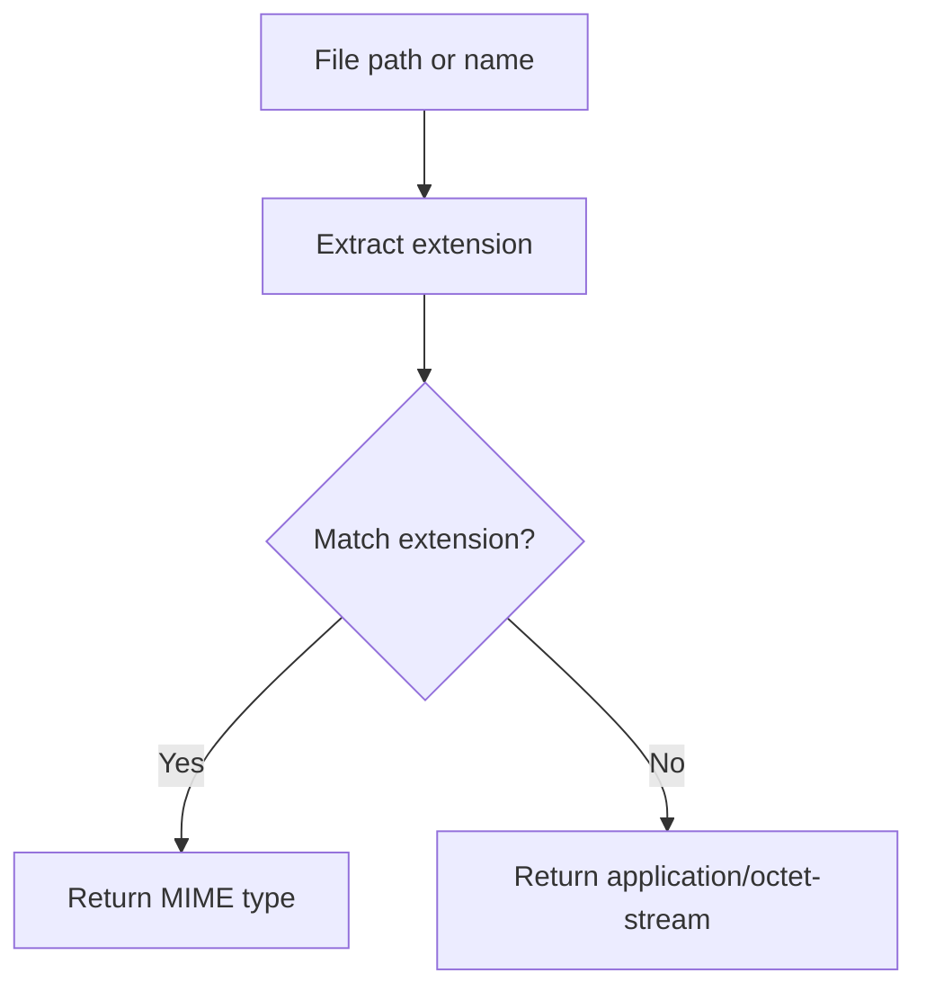
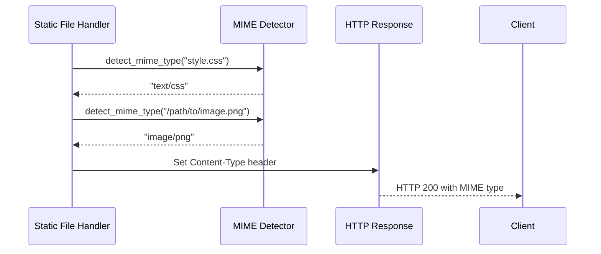

# Utils Module

The Utils module provides shared utility functions used throughout the DSB codebase.

## Table of Contents

1. [Overview](#overview)
2. [MIME Type Detection](#mime-type-detection)
3. [File Structure](#file-structure)
4. [Usage Examples](#usage-examples)

---

## Overview

The Utils module provides:

- **MIME Type Detection**: Detect file types from extensions
- **Common Utilities**: Shared helper functions

---

## MIME Type Detection

### detect_mime_type Function



### Supported MIME Types

```mermaid
erDiagram
    FileExtension ||--|| MimeType : Maps to

    FileExtension {
        string ext "Extension"
    }

    MimeType {
        string type "MIME type"
        string category "Category"
    }
```

### MIME Type Categories

| Category | Extensions | MIME Type |
|----------|------------|-----------|
| **HTML** | `.html`, `.htm` | `text/html` |
| **CSS** | `.css` | `text/css` |
| **JavaScript** | `.js`, `.mjs`, `.cjs` | `application/javascript` |
| **JSON** | `.json` | `application/json` |
| **XML** | `.xml`, `.xsl`, `.xsd` | `application/xml` |
| **Images** | `.png` | `image/png` |
| | `.jpg`, `.jpeg` | `image/jpeg` |
| | `.gif` | `image/gif` |
| | `.svg` | `image/svg+xml` |
| | `.ico` | `image/x-icon` |
| | `.webp` | `image/webp` |
| **Fonts** | `.woff` | `font/woff` |
| | `.woff2` | `font/woff2` |
| | `.ttf` | `font/ttf` |
| | `.otf` | `font/otf` |
| **Text** | `.txt` | `text/plain` |
| | `.md` | `text/markdown` |
| | `.csv` | `text/csv` |
| **Archives** | `.zip` | `application/zip` |
| | `.tar` | `application/x-tar` |
| | `.gz` | `application/gzip` |
| **Media** | `.mp3` | `audio/mpeg` |
| | `.mp4` | `video/mp4` |
| | `.webm` | `video/webm` |
| **Default** | Unknown | `application/octet-stream` |

### Usage Flow



---

## File Structure

```
src/utils/
├── mod.rs                    # Module exports (1.3KB)
│   └── detect_mime_type()    # Main function
└── mime.rs                   # MIME detection (184 lines)
    ├── detect_mime_type()    # Detect MIME type from file path
    └── tests                 # Comprehensive tests
```

---

## Usage Examples

### Basic Usage

```rust
use dsb::utils::mime::detect_mime_type;

// Detect from filename
let mime = detect_mime_type("index.html");
assert_eq!(mime, "text/html");

// Detect from path
let mime = detect_mime_type("/path/to/style.css");
assert_eq!(mime, "text/css");

// Unknown extension
let mime = detect_mime_type("file.xyz");
assert_eq!(mime, "application/octet-stream");
```

### In API Handler

```rust
use crate::utils::mime::detect_mime_type;

async fn serve_static_file(
    Path((sandbox_id, file_path)): Path<(Uuid, String)>,
    State(service): State<Arc<StaticFileService>>,
) -> Result<Response> {
    // Detect MIME type
    let content_type = detect_mime_type(&file_path);

    // Read file
    let content = service.read_file(&sandbox_id, &file_path).await?;

    // Build response with Content-Type
    let mut response = content.into_response();
    response.headers_mut().insert(
        ContentType::header(),
        content_type.parse()?,
    );

    Ok(response)
}
```

---

## See Also

- [API Module](../api/README.md) - Uses MIME detection for static files
- [Static File Serving](../static_serving/STATIC_SERVING.md) - MIME type usage
