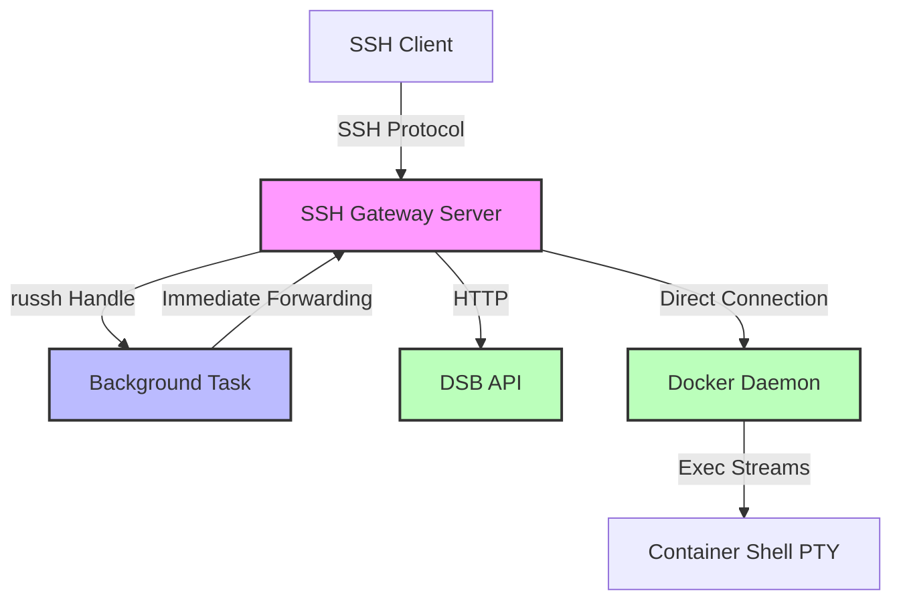
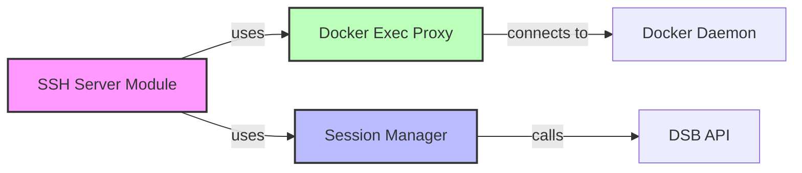
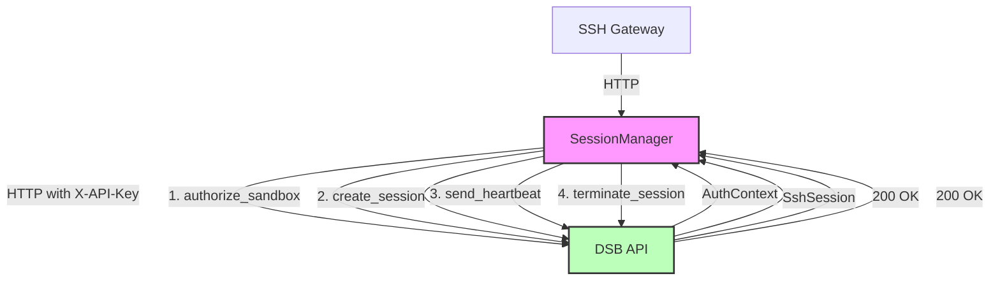

# DSB SSH Gateway - Developer & API Reference

> **Use this guide** for module internals, the full Rust API surface, detailed troubleshooting, and test patterns. For end-user setup, configuration, and quick start, see [`README.md`](./README.md).

## Table of Contents

1. [Developer Reference](#developer-reference)
   - [Architecture Overview](#architecture-overview)
   - [Docker Exec Proxy Module](#docker-exec-proxy-module)
   - [Session Manager Module](#session-manager-module)
   - [SSH Server Module](#ssh-server-module)
2. [API Reference](#api-reference)
   - [Docker Exec Proxy API](#docker-exec-proxy-api)
   - [Session Manager API](#session-manager-api)
   - [SSH Session API](#ssh-session-api)
3. [Testing](#testing)
4. [Troubleshooting (Detailed)](#troubleshooting-detailed)

---

## Developer Reference

### Architecture Overview

#### System Overview



#### Module Relationships



#### Data Flow

**SSH Connection Flow:**

1. SSH client connects → SSH Server
2. SSH Server → Session Manager → DSB API (authorize)
3. SSH Server → Docker Exec Proxy → Docker (create exec)
4. Background task reads Docker output → Handle → SSH client (immediate)
5. SSH client input → Docker stdin (bidirectional)
6. Session Manager sends heartbeat to DSB API
7. On disconnect → Session Manager terminates session

**Key Modules:**

- **SSH Server (`src/ssh.rs`)** - russh-based SSH protocol handling
- **Docker Exec Proxy (`src/docker.rs`)** - Direct Docker connection for exec operations
- **Session Manager (`src/session.rs`)** - DSB API client for authorization and tracking

### Docker Exec Proxy Module

The `DockerExecProxy` module manages Docker exec instances with PTY (pseudo-terminal) support.

#### Architecture

```
┌─────────────┐     stdin      ┌─────────────────┐
│ SSH Gateway │──────────────>│                 │
│             │               │ DockerExecProxy │
│             │<──────────────│                 │
│             │ stdout/stderr └─────────────────┘
└─────────────┘                      │
                                      ▼
                              ┌───────────────┐
                              │ Docker Daemon │
                              └───────────────┘
                                      │
                                      ▼
                              ┌───────────────┐
                              │  Container    │
                              │  Shell (PTY)  │
                              └───────────────┘
```

#### Key Features

- Exec instance creation with PTY allocation
- Bidirectional streaming (stdin/stdout/stderr)
- PTY resize support
- Stream demultiplexing (stdout/stderr separation)
- Exec lifecycle management (start, inspect, cleanup)

#### Component Interaction

1. **SSH Gateway** → Creates DockerExecProxy instance
2. **DockerExecProxy** → Calls Docker API to create exec
3. **Docker API** → Returns exec ID
4. **DockerExecProxy** → Starts exec, gets I/O streams
5. **Background Task** → Reads Docker output, forwards to SSH client
6. **SSH Gateway** → Forwards user input to Docker stdin

### Session Manager Module

The `SessionManager` handles HTTP communication with the DSB API for SSH session management.

#### Architecture



#### DSB API Endpoints

| Endpoint | Method | Purpose |
|----------|--------|---------|
| `/ssh/authorize/{sandbox_id}` | GET | Authorize sandbox access |
| `/ssh-sessions` | POST | Create new SSH session |
| `/ssh-sessions/{id}/heartbeat` | POST | Update session activity |
| `/ssh-sessions/{id}/terminate` | POST | Terminate session |

#### Key Features

- HTTP-based API client using `reqwest`
- API key authentication support
- Full session lifecycle management
- Comprehensive error handling
- Structured logging with `tracing`

**Important Note**: The SSH gateway connects **directly** to Docker daemon for exec operations, not through the DSB API. The DSB API is used **only** for authorization, session tracking, and lifecycle management.

### SSH Server Module

The SSH Server module (`src/ssh.rs`) implements the SSH protocol using the `russh` library.

#### Key Components

- **russh Server**: Handles SSH protocol and encryption
- **Handle-based I/O**: Immediate output forwarding to client
- **Background Tasks**: Async tasks for reading Docker output
- **PTY Management**: Terminal size and window changes
- **Authentication**: Public key authentication

#### Immediate Output Forwarding

The SSH gateway uses a Handle-based architecture for immediate output forwarding:

1. Docker output is read in background task
2. Data is immediately written to russh Handle
3. Handle forwards directly to SSH client
4. No buffering or delays

---

## API Reference

### Docker Exec Proxy API

#### Constructor

```rust
pub fn new(container_id: String) -> Self
pub fn with_docker(container_id: String, docker: Docker) -> Self
```

**Example:**

```rust
use ssh_gateway::docker::DockerExecProxy;

// With default Docker client
let mut proxy = DockerExecProxy::new("my-container".to_string());

// With custom Docker client
use bollard::Docker;
let docker = Docker::connect_with_unix(
    "unix:///var/run/docker.sock",
    120,
    bollard::API_DEFAULT_VERSION
)?;
let proxy = DockerExecProxy::with_docker("container-123".to_string(), docker);
```

#### Lifecycle Methods

```rust
pub async fn create_exec(&mut self) -> Result<String>
pub async fn start_exec(&mut self) -> Result<()>
```

**Example:**

```rust
// Create exec with PTY
let exec_id = proxy.create_exec().await?;

// Start exec and get I/O streams
proxy.start_exec().await?;
```

#### I/O Operations

```rust
pub async fn write_stdin(&mut self, data: &[u8]) -> Result<()>
pub async fn read_output(&mut self) -> Option<Result<Vec<u8>>>
```

**Example:**

```rust
// Write to container stdin
proxy.write_stdin(b"echo 'Hello World'\n").await?;

// Read from container stdout/stderr
if let Some(Ok(data)) = proxy.read_output().await {
    println!("Output: {}", String::from_utf8_lossy(&data));
}
```

#### PTY Management

```rust
pub async fn resize_pty(&mut self, rows: u16, cols: u16) -> Result<()>
pub fn set_pty_size(&mut self, rows: u16, cols: u16)
```

**Example:**

```rust
// Set initial PTY size
proxy.set_pty_size(24, 80);

// Resize during session
proxy.resize_pty(50, 160).await?;
```

#### Inspection

```rust
pub async fn inspect_exec(&self) -> Result<bollard::models::ExecInspectResponse>
pub async fn is_running(&self) -> Result<bool>
pub async fn get_exit_code(&self) -> Result<Option<i64>>
```

**Example:**

```rust
// Check if exec is running
if proxy.is_running().await? {
    println!("Exec is still running");
} else {
    if let Ok(Some(code)) = proxy.get_exit_code().await {
        println!("Exited with code: {}", code);
    }
}
```

### Session Manager API

#### Constructor

```rust
pub fn new(api_url: &str, api_key: Option<String>) -> Self
```

**Example:**

```rust
use ssh_gateway::session::SessionManager;

// Without API key (development mode)
let manager = SessionManager::new("http://localhost:8080", None);

// With API key (production mode)
let manager = SessionManager::new(
    "http://localhost:8080",
    Some("your-secret-api-key".to_string())
);
```

#### Authorization

```rust
pub async fn authorize_sandbox(&self, sandbox_id: &uuid::Uuid) -> Result<AuthContext>
```

**Validates:**

1. API key (if configured)
2. Sandbox exists
3. Sandbox is in "running" state

**Example:**

```rust
use uuid::Uuid;

let sandbox_id = Uuid::parse_str("123e4567-e89b-12d3-a456-426614174000")?;
let auth = manager.authorize_sandbox(&sandbox_id).await?;

if auth.authorized {
    let container_id = auth.sandbox.unwrap().container_id;
    // Proceed with SSH connection
} else {
    // Deny access
}
```

#### Session Lifecycle

```rust
pub async fn create_session(
    &self,
    sandbox_id: &uuid::Uuid,
    client_ip: &str
) -> Result<SshSession>
```

**Example:**

```rust
let session = manager.create_session(&sandbox_id, "192.168.1.100").await?;
println!("Session ID: {}", session.id);
println!("Connected at: {}", session.connected_at);
```

#### Heartbeat

```rust
pub async fn send_heartbeat(
    &self,
    session_id: &uuid::Uuid,
    bytes_sent: i64,
    bytes_received: i64
) -> Result<()>
```

**Recommended Interval:** Every 30 seconds

**Example:**

```rust
// In a background task
loop {
    tokio::time::sleep(Duration::from_secs(30)).await;
    manager.send_heartbeat(&session_id, total_sent, total_received).await?;
}
```

#### Termination

```rust
pub async fn terminate_session(
    &self,
    session_id: &uuid::Uuid,
    reason: &str
) -> Result<()>
```

**Call this when:**

- Client disconnects
- Authentication fails
- Connection error occurs

**Example:**

```rust
// On disconnect
manager.terminate_session(&session_id, "Client disconnected").await?;
```

### SSH Session API

The SSH gateway doesn't expose a direct REST API for SSH sessions. Instead, SSH sessions are managed through the standard SSH protocol. Session state is tracked internally and communicated with the DSB API via the Session Manager.

#### Session State Tracking

Sessions tracked by the gateway include:

- `id`: Session UUID
- `sandbox_id`: Associated sandbox ID
- `state`: Session state (active, terminated)
- `client_ip`: Client IP address
- `connected_at`: Connection timestamp
- `last_activity_at`: Last activity timestamp
- `bytes_sent`: Total bytes sent to client
- `bytes_received`: Total bytes received from client

#### Session Monitoring

```bash
# View active sessions via DSB API
curl -H "X-API-Key: $DSB_API_KEY" \
  https://dsb.yourdomain.com/ssh-sessions?state=active

# View session statistics
curl -H "X-API-Key: $DSB_API_KEY" \
  https://dsb.yourdomain.com/ssh-sessions/statistics
```

---

## Testing

### Unit Tests

```bash
# Run all tests
cargo test

# Run specific module tests
cargo test docker::tests
cargo test session::tests
cargo test ssh::tests

# Run with output
cargo test -- --nocapture
```

### Integration Tests

Integration tests require a running DSB API server and Docker daemon.

```bash
# Ensure DSB API is running
curl http://localhost:8080/health

# Ensure Docker is running
docker ps

# Run integration tests
cargo test --test integration_tests

# Run specific integration test
cargo test test_docker_exec_read_output
```

### Test Coverage

```bash
# Generate coverage report
cargo tarpaulin --out Html

# Or with the project's make command
make coverage
```

### Example Unit Test

```rust
#[cfg(test)]
mod tests {
    use super::*;

    #[test]
    fn test_pty_size_default() {
        let size = PtySize::default();
        assert_eq!(size.rows, 24);
        assert_eq!(size.cols, 80);
    }

    #[test]
    fn test_session_manager_creation() {
        let manager = SessionManager::new("http://localhost:8080", None);
        assert_eq!(manager.get_api_url(), "http://localhost:8080");
        assert!(manager.api_key.is_none());
    }
}
```

### Example Integration Test

```rust
#[tokio::test]
async fn test_docker_exec_create() {
    // Start a test container
    let docker = Docker::connect_with_unix_defaults().unwrap();
    let container = create_test_container(&docker).await;

    // Create proxy
    let mut proxy = DockerExecProxy::new(container.id.clone());

    // Create exec
    let exec_id = proxy.create_exec().await.unwrap();
    assert!(!exec_id.is_empty());

    // Cleanup
    cleanup_container(&docker, &container.id).await;
}
```

---

## Troubleshooting (Detailed)

### Problem: "Permission denied (publickey)"

**Symptoms:**

```
Permission denied (publickey,gssapi-keyex,gssapi-with-mic).
```

**Solutions:**

```bash
# 1. Check your SSH key is being used
ssh -vvv -p 2222 <sandbox-id>@localhost

# 2. Specify your SSH key explicitly
ssh -i ~/.ssh/id_rsa -p 2222 <sandbox-id>@localhost

# 3. Add key to SSH agent
ssh-add ~/.ssh/id_rsa

# 4. Verify gateway is accepting public key auth
# Check gateway logs for "Public key authentication for user: <id>"
```

### Problem: "Connection refused"

**Symptoms:**

```
ssh: connect to host localhost port 2222: Connection refused
```

**Solutions:**

```bash
# 1. Check if SSH gateway is running
ps aux | grep ssh-gateway
pgrep -a ssh-gateway

# 2. Check if port is listening
netstat -an | grep 2222
# or
ss -tlnp | grep 2222

# 3. Check gateway logs for startup errors
# If running via cargo:
cargo run -- --port 2222 --api-url http://localhost:8080

# 4. Verify port is not already in use
lsof -i :2222
```

### Problem: "Session terminated immediately"

**Symptoms:**

```
Connection to localhost closed by remote host.
```

**Solutions:**

```bash
# 1. Check sandbox exists and is running
curl http://localhost:8080/sandboxes/<sandbox-id>
dsb info <sandbox-id>

# 2. Verify DSB API is accessible
curl http://localhost:8080/health

# 3. Check gateway logs for authorization errors
# Look for messages like "Authorization failed for sandbox: <id>"

# 4. Verify sandbox container is running
docker ps | grep <container-id>

# 5. Enable debug logging to see full flow
RUST_LOG=debug cargo run -- --port 2222 --api-url http://localhost:8080
```

### Problem: "No shell prompt"

**Symptoms:**

```
# Connection successful but no prompt appears
```

**Solutions:**

```bash
# 1. Check container has a shell
docker exec <container-id> which bash
docker exec <container-id> which sh

# 2. Try pressing Enter (sometimes prompt is hidden)
# After connecting, press Enter key

# 3. Check PTY allocation was successful
# Enable debug logs and look for "PTY request"

# 4. Verify container is running correct image
docker inspect <container-id> | grep -i image
```

### Problem: "Output appears all at once (buffered)"

**Symptoms:**

```
# Expected: Each line appears immediately
# Actual: All lines appear after command completes
```

**This should NOT happen with the Handle-based implementation.** If it does:

```bash
# 1. Verify you're using the latest version
ssh-gateway --version

# 2. Check for "Immediate Output" in logs
# Should see: "Successfully forwarded X bytes to SSH client via Handle"

# 3. Test with unbuffered command
ssh -p 2222 <id>@localhost
# Then run: python -u -c "import time; [print(f'Line {i}') or time.sleep(0.2) for i in range(5)]"

# 4. Check for buffering in your application
# Use unbuffered Python: python -u
# Flush output explicitly: sys.stdout.flush()
```

### Problem: "Host key verification failed"

**Symptoms:**

```
@@@@@@@@@@@@@@@@@@@@@@@@@@@@@@@@@@@@@@@@@@@@@@@@@@@@@@@@@@@
@    WARNING: REMOTE HOST IDENTIFICATION HAS CHANGED!     @
@@@@@@@@@@@@@@@@@@@@@@@@@@@@@@@@@@@@@@@@@@@@@@@@@@@@@@@@@@@
```

**Solutions:**

```bash
# With persistent host keys, this warning indicates a potential
# security issue (man-in-the-middle attack) or intentional key rotation.

# Option 1: Investigate first (Recommended)
# Check if key file was intentionally regenerated
ls -la ~/.dsb/ssh_host_key

# Check gateway logs for key generation
# If you see "Auto-generating persistent SSH host key", the key was regenerated

# Option 2: Remove old key (if key was rotated)
ssh-keygen -R "[localhost]:2222"

# Reconnect to accept new key
ssh -p 2222 <sandbox-id>@localhost

# Option 3: Verify legitimate key change
# Contact your administrator if running in production
# Verify the gateway host key fingerprint
# Only accept if you're certain the change is legitimate
```

**Prevention**:

- Don't delete `~/.dsb/ssh_host_key` unless intentional
- Back up custom host keys if using `--host-key-path`
- Monitor file system changes to key directory

### Debug Mode

For detailed troubleshooting, enable verbose SSH logging:

```bash
# Verbose mode (shows all steps)
ssh -vvv -p 2222 <sandbox-id>@localhost

# With custom log level
ssh -vvv -p 2222 <sandbox-id>@localhost 2>&1 | tee ssh-debug.log

# Check what the gateway is doing
# In another terminal, watch the logs:
tail -f /var/log/syslog | grep ssh-gateway
# or if running via cargo:
RUST_LOG=debug cargo run -- --port 2222 --api-url http://localhost:8080
```

### Getting Help

If you encounter issues not covered here:

```bash
# 1. Check all components are running
# DSB Server
curl http://localhost:8080/health

# SSH Gateway
ps aux | grep ssh-gateway

# Docker
docker ps

# 2. Collect logs
# Gateway logs (with debug)
RUST_LOG=debug ssh-gateway --port 2222 --api-url http://localhost:8080

# SSH client logs
ssh -vvv -p 2222 <id>@localhost

# 3. Verify configuration
# Check API URL and port are correct
# Check sandbox ID is correct (copy-paste to avoid typos)
# Check Docker socket is accessible: echo $DOCKER_HOST

# 4. Test with simpler tools
# Test sandbox exists:
curl http://localhost:8080/sandboxes/<sandbox-id>

# Test Docker exec directly:
docker exec <container-id> echo "test"
```

---

**Last Updated**: 2026-06-02
**Status**: Production Ready ✅
