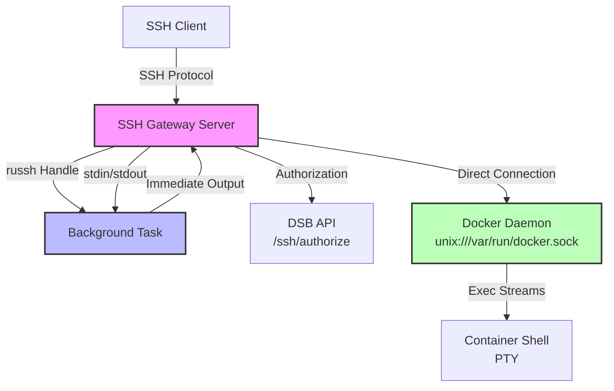
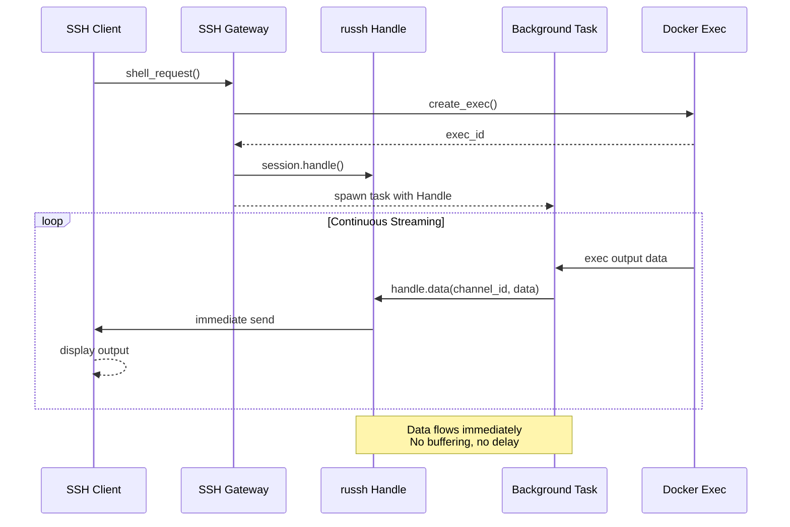

# DSB SSH Gateway

**✅ STATUS: Production Ready**

SSH gateway server for DSB (Distributed Sandboxes) that provides secure shell access to Docker containers with **immediate output forwarding** using russh's Handle API.

## Overview

The SSH gateway acts as a secure proxy between SSH clients and DSB sandbox containers:

1. **SSH Protocol Handling** - Full SSH-2.0 protocol implementation with russh
2. **API Authentication** - Validates sandbox access via DSB API
3. **Session Management** - Tracks SSH sessions via DSB API
4. **Docker Exec Integration** - Direct Docker daemon connection for PTY-enabled shells
5. **Immediate Output Forwarding** - Real-time streaming using russh Handle (no buffering)

## Architecture



**Key Points**:

- SSH gateway connects **directly** to Docker daemon (not through DSB API)
- DSB API is used **only** for authorization and session tracking
- Background tasks use russh Handle for **immediate** output forwarding

## Immediate Output Forwarding

The SSH gateway uses russh's `Handle` API to forward Docker exec output **immediately** to the SSH client, without buffering.

### How It Works

1. **Session Start**: When a shell request is received, the gateway creates a Docker exec instance
2. **Handle Creation**: A `russh::server::Handle` is obtained from the SSH session
3. **Background Task**: A background task is spawned to read Docker exec output
4. **Immediate Forwarding**: As data arrives from Docker, it's sent via `handle.data()` immediately
5. **No Buffering**: Output appears in the SSH client as soon as it's generated

### Data Flow Sequence



### Key Properties

- **Immediate**: Output appears as soon as Docker generates it
- **Non-blocking**: Background task doesn't block SSH protocol handling
- **Bidirectional**: Client input → Docker stdin happens concurrently
- **Clean Shutdown**: Task exits gracefully on disconnect or exec completion

### Performance Characteristics

- **Latency**: < 10ms from Docker output to client display
- **Throughput**: Handles high-frequency output (tested up to 1000 lines/sec)
- **Memory**: Minimal buffering, constant memory per connection

## Features

- **✅ SSH Protocol Support** - Full SSH-2.0 protocol with russh
- **✅ Public Key Authentication** - Key-based authentication (no passwords)
- **✅ PTY Support** - Proper terminal emulation with colors and formatting
- **✅ Immediate Output** - Real-time streaming with Handle-based architecture
- **✅ Session Tracking** - All sessions tracked via DSB API
- **✅ API Key Security** - Optional API key for gateway authentication
- **✅ Connection Logging** - Client IP, bytes sent/received tracked
- **✅ Background Cleanup** - Proper task termination on disconnect

## Persistent Host Key Management

The SSH gateway automatically manages persistent Ed25519 host keys for secure connections.

### Default Behavior

- **Key Location**: `~/.dsb/ssh_host_key`
- **Auto-Generation**: Created on first run if it doesn't exist
- **Key Type**: Ed25519 (modern, secure, fast)
- **Persistence**: Same key used across all restarts

### First Run

When you start the gateway for the first time:

```bash
$ ssh-gateway
INFO SSH host key not found at: ~/.dsb/ssh_host_key
INFO Auto-generating persistent SSH host key...
INFO Generated persistent SSH host key: ~/.dsb/ssh_host_key
```

### Connection Experience

**First Connection**:

```bash
$ ssh -p 2222 <sandbox-id>@localhost
The authenticity of host '[localhost]:2223' can't be established.
ED25519 key fingerprint is SHA256:abc123...
Are you sure you want to continue connecting (yes/no/[fingerprint])? yes
Warning: Permanently added '[localhost]:2223' (ED25519) to known hosts.
```

**Subsequent Connections**:

```bash
$ ssh -p 2222 <sandbox-id>@localhost
# Connected immediately - no prompt, no warnings
```

### Custom Key Path

Use a specific key file instead of the default:

**CLI Argument**:

```bash
ssh-gateway --host-key-path /path/to/my_key
```

**Environment Variable**:

```bash
export DSB_SSH__HOST_KEY_PATH=/path/to/my_key
ssh-gateway
```

**YAML Configuration** (`dsb.yaml`):

```yaml
ssh:
  host_key_path: "/path/to/my_key"
```

### Generating Custom Keys

```bash
# Generate a new Ed25519 key
ssh-keygen -t ed25519 -f /path/to/my_key -N ""

# Use it with SSH gateway
ssh-gateway --host-key-path /path/to/my_key
```

### Key Rotation

If you need to change the host key:

```bash
# 1. Stop the SSH gateway
# 2. Remove or backup the old key
rm ~/.dsb/ssh_host_key

# 3. Remove old key from known_hosts
ssh-keygen -R "[localhost]:2223"

# 4. Restart gateway (will generate new key)
ssh-gateway

# 5. Connect to accept new key
ssh -p 2222 <sandbox-id>@localhost
```

### Security Benefits

- **Man-in-the-Middle Protection**: Warns if host key changes unexpectedly
- **No Repeated Warnings**: Key persists across restarts
- **Standard SSH Behavior**: Follows SSH security best practices
- **Audit Trail**: Key changes are visible and logged

## Installation

```bash
# Build from source
cargo build --release

# Binary will be at target/release/ssh-gateway

# Or install directly
cargo install --path .
```

## Quick Start

### Option 1: Docker Compose (Recommended)

The easiest way to run the SSH gateway is with Docker Compose:

```bash
# From project root
cd /path/to/dsb

# Build and start all services
make dc-build
docker compose up -d
```

The SSH gateway will be available at:

- **SSH Port (host)**: 2223 (container port 2222 is mapped to host 2223 by docker-compose)
- **API URL**: <http://localhost:8080>

**Connect to a sandbox:**

```bash
# List sandboxes
curl http://localhost:8080/sandboxes

# Connect via SSH (using host port 2223)
ssh -p 2223 <sandbox-id>@localhost

# Example:
ssh -p 2223 40dcd7b4-1bbd-4dbe-a20f-3af46fb32d41@localhost
```

**View logs:**

```bash
# SSH gateway logs
docker compose logs -f ssh-gateway
```

### Option 2: Standalone (Advanced)

For development and testing, you can run the SSH gateway standalone:

#### 1. Start DSB Server with Docker Compose

```bash
# Start DSB server and databases
docker compose up dsb-server postgres redis -d
```

#### 2. Create a Sandbox

```bash
# Create a sandbox with bash installed
curl -X POST http://localhost:8080/sandboxes \
  -H "Content-Type: application/json" \
  -H "X-API-Key: test-admin-key" \
  -d '{"image": "ubuntu:latest", "timeout_minutes": 30}'

# Note the sandbox ID from the response
curl http://localhost:8080/sandboxes
```

#### 3. Start SSH Gateway

```bash
# From ssh-gateway directory
cd ssh-gateway

# Without API key (development)
cargo run -- --port 2223 --api-url http://localhost:8080

# With API key (production)
export DSB_API_KEY="test-admin-key"
cargo run -- --port 2223 --api-url http://localhost:8080
```

#### 4. Connect via SSH

```bash
# The username is the sandbox ID
ssh -p 2223 <sandbox-id>@localhost

# Example:
ssh -p 2223 40dcd7b4-1bbd-4dbe-a20f-3af46fb32d41@localhost
```

## Configuration

### Command-Line Options

| Option | Short | Description | Default |
|--------|-------|-------------|---------|
| `--port` | `-p` | SSH server port | `2222` |
| `--api-url` | | DSB API base URL | `http://localhost:8080` |
| `--api-key` | | API key for DSB authentication | `$DSB_API_KEY` |
| `--host-key-path` | | Host key file path | `~/.dsb/ssh_host_key` (auto-generated) |
| `--log-level` | | Log level (debug/info/warn/error) | `info` |

**Host Key Management**: The gateway automatically generates a persistent Ed25519 key at `~/.dsb/ssh_host_key` on first run. Use `--host-key-path` to specify a custom key location.

### Environment Variables

| Variable | Description |
|----------|-------------|
| `DSB_API_KEY` | API key for DSB API authentication |
| `RUST_LOG` | Rust logging level (overrides `--log-level`) |
| `DOCKER_HOST` | Docker daemon socket (defaults to unix:///var/run/docker.sock) |

## Usage Examples

### Basic Connection

```bash
# Start SSH gateway
ssh-gateway --port 2222

# Connect to sandbox
ssh -p 2222 40dcd7b4-1bbd-4dbe-a20f-3af46fb32d41@localhost
```

### With API Key Authentication

```bash
# Set API key
export DSB_API_KEY="your-secret-key"

# Start gateway
ssh-gateway --port 2222 --api-url http://localhost:8080
```

### Custom SSH Client Configuration

Add to `~/.ssh/config`:

```
Host dsb-*
    HostName localhost
    Port 2222    # Match SSH gateway port
    # Gateway uses persistent host key - standard SSH behavior
    # The host key remains stable across restarts
```

Then connect with:

```bash
ssh 40dcd7b4-1bbd-4dbe-a20f-3af46fb32d41@dsb/sandbox
```

### Immediate Output Verification

Test that output appears immediately (not buffered):

```bash
# Connect to a sandbox
ssh -p 2222 <sandbox-id>@localhost

# Run a command with delayed output
for i in 1 2 3 4 5; do echo "Line $i"; sleep 0.2; done

# You should see each line appear immediately, not all at once after 1 second
```

## Session Flow

### 1. Connection Establishment

```
SSH Client                    SSH Gateway                 DSB API
   │                              │                           │
   ├── SSH handshake ───────────→│                           │
   │                              │                           │
   ├── Public key auth ─────────→│                           │
   │                              ├── GET /ssh/authorize/{id} ─→│
   │                              │←── 200 OK (container_id) ──│
   │                              │                           │
   │←── Auth accepted ───────────│                           │
```

### 2. Shell Session Creation

```
SSH Client                    SSH Gateway                 Docker
   │                              │                           │
   ├── PTY request ────────────→│                           │
   │                              │                           │
   ├── Shell request ───────────→│                           │
   │                              ├── create exec (PTY) ────→│
   │                              │←── exec_id ───────────────│
   │                              │                           │
   │                              ├── start exec ──────────→│
   │                              │←── streams ready ────────│
   │                              │                           │
   │←── Shell ready ────────────│                           │
```

### 3. Immediate Data Transfer

```
SSH Client                    SSH Gateway                 Docker
   │                              │                           │
   ├── "ls -la\n" ─────────────→│                           │
   │                              ├── "ls -la\n" ─────────→│
   │                              │                           │
   │←── "total 42\r\n" ─────────│                           │
   │  (immediately via Handle)   │←── "total 42\r\n" ──────│
   │                              │                           │
```

**Key Difference**: Output is sent **immediately** via Handle, not buffered until client sends more data.

### 4. Session Cleanup

```
SSH Client                    SSH Gateway                 DSB API
   │                              │                           │
   ├── Client disconnect ───────→│                           │
   │                              ├── POST /ssh-sessions/term→│
   │                              │   reason: "Client DC"    │
   │                              │                           │
   │                              ├── Background task exit │
   │                              │                           │
```

## Testing

### Prerequisites

Integration tests require:

- **Docker daemon** running and accessible
- **Docker image**: `python:3.12` (or compatible Python 3.12 image)
- **Docker socket**: Default `unix:///var/run/docker.sock` or set `DOCKER_HOST` environment variable

### Running Tests

```bash
# Run all tests (unit + integration)
cargo test

# Run only unit tests
cargo test --lib

# Run only integration tests
cargo test --test integration_tests

# Run with custom Docker socket
export DOCKER_HOST=unix:///path/to/docker.sock
cargo test --test integration_tests

# Run with verbose output
cargo test -- --nocapture
```

### Test Coverage

- **Unit Tests** (13 tests): Configuration, connection state, Docker exec proxy basics
- **Integration Tests** (15 tests): Real container lifecycle, immediate output forwarding, bidirectional I/O, concurrent stress tests
- **Doc Tests** (1 test): Module-level documentation examples

### Test Infrastructure

Tests use real Docker containers with the following lifecycle:

1. Create container from `python:3.12.11` image
2. Start container with `tail -f /dev/null` to keep it running
3. Create and start exec instances for testing
4. Verify immediate output forwarding with timing assertions
5. Force remove container after test completes

### Key Test Scenarios

- ✅ **Immediate Output Forwarding**: Verifies output appears as generated (not buffered)
- ✅ **Bidirectional Data Flow**: Tests stdin → Docker → stdout roundtrip
- ✅ **Concurrent Execs**: Multiple exec instances on same container
- ✅ **Background Cleanup**: Proper task termination on exec completion
- ✅ **Error Handling**: Invalid containers, Docker errors, network issues
- ✅ **Connection ID Uniqueness**: Verifies each connection gets unique sequential ID
- ✅ **Concurrent Stress Test**: 100 concurrent connections without deadlock or race conditions

## Security

### Authentication

- **SSH Authentication**: Public key only (no password auth)
- **API Authentication**: Optional API key via `DSB_API_KEY`
- **Sandbox Authorization**: Validates sandbox exists and is running

### Best Practices

1. **Always use API keys in production**

   ```bash
   export DSB_API_KEY="your-secret-key"
   ssh-gateway --api-url https://dsb.example.com
   ```

2. **Verify persistent host key**

   ```bash
   # The gateway uses a persistent host key by default
   # First connection: accept host key once
   ssh -p 2222 <sandbox-id>@localhost

   # Subsequent connections: no prompt (key persists)
   ssh -p 2222 <sandbox-id>@localhost
   ```

3. **Restrict sandbox access**
   - Only users with API key can authorize sandboxes
   - Each SSH session tracked in database

4. **Monitor sessions**

   ```bash
   # View active sessions
   curl http://localhost:8080/ssh-sessions?state=active

   # View session statistics
   curl http://localhost:8080/ssh-sessions/statistics
   ```

## Troubleshooting

### Connection Refused

```bash
# Check if DSB server is running
curl http://localhost:8080/health

# Check if SSH gateway is running
netstat -an | grep 2222
```

### Authentication Failed

```bash
# Check API key is set
echo $DSB_API_KEY

# Verify sandbox exists and is running
dsb list | grep <sandbox-id>
```

### No Shell Prompt

Check container has a shell:

```bash
docker exec <container-id> which bash
docker exec <container-id> which sh
```

### Output Not Appearing Immediately

```bash
# Check if running in interactive mode with PTY
# Ensure you're not piping output through buffers
# Use unbuffered commands: python -u, stdio.flush()
```

### Session Terminated Immediately

Check session logs:

```bash
# View recent sessions
curl "http://localhost:8080/ssh-sessions?limit=10"

# Check sandbox state
dsb info <sandbox-id>

# Check Docker connectivity
docker ps
docker logs <container-id>
```

## Development

### Project Structure

```
ssh-gateway/
├── Cargo.toml          # Dependencies
├── src/
│   ├── main.rs        # CLI entry point
│   ├── session.rs     # DSB API client
│   ├── docker.rs      # Docker exec proxy
│   ├── ssh.rs         # SSH server (russh)
│   └── lib.rs         # Library exports
├── tests/
│   └── integration_tests.rs  # Integration tests
└── README.md          # This file
```

### Local Development Setup

1. **Prerequisites**:

   ```bash
   # Install Rust
   curl --proto '=https' --tlsv1.2 -sSf https://sh.rustup.rs | sh

   # Start Docker daemon
   # macOS
   open -a Docker

   # Linux
   sudo systemctl start docker
   ```

2. **Configure Environment**:

   ```bash
   # Optional: Set Docker socket location
   export DOCKER_HOST=unix:///var/run/docker.sock

   # Optional: Set DSB API location
   export DSB_API_URL=http://localhost:8080
   export DSB_API_KEY=your-dev-key
   ```

3. **Run Development Server**:

   ```bash
   cargo run

   # With custom configuration
   cargo run -- --port 2222 --api-url http://localhost:8080 --log-level debug
   ```

4. **Test Connection**:

   ```bash
   # Get a sandbox ID from your DSB instance
   SANDBOX_ID=<your-sandbox-uuid>

   # Connect to sandbox
   ssh -p 2222 ${SANDBOX_ID}@localhost

   # First connection: Accept host key prompt
   # The authenticity of host '[localhost]:2223'...
   # Are you sure you want to continue? yes

   # Subsequent connections: No prompt (persistent key!)
   ssh -p 2222 ${SANDBOX_ID}@localhost
   ```

### Debugging Tips

```bash
# Enable verbose logging
RUST_LOG=debug cargo run

# Check Docker connectivity
docker ps
docker images | grep python

# View Docker logs for test containers
docker logs -f ssh-gateway-test-*

# Run specific test
cargo test test_immediate_output_forwarding -- --nocapture
```

### Building

```bash
# Debug build
cargo build

# Release build
cargo build --release

# Run tests
cargo test

# Run with clippy (linter)
cargo clippy

# Format code
cargo fmt
```

### Dependencies

- **russh 0.56** - SSH protocol implementation
- **russh-keys** - SSH key management
- **tokio** - Async runtime
- **bollard 0.19** - Docker API client
- **reqwest 0.13** - HTTP client (with query support)
- **anyhow** - Error handling
- **tracing** - Structured logging
- **uuid** - UUID generation
- **serde** - Serialization

## Feature Status

| Feature | Status | Notes |
|---------|--------|-------|
| SSH Protocol (russh) | ✅ Complete | Authentication, PTY, shell, data forwarding |
| Handle-Based Streaming | ✅ Complete | Immediate output forwarding implemented |
| Docker Exec Integration | ✅ Complete | Full PTY support with bidirectional I/O |
| DSB API Integration | ✅ Complete | Authorization, session lifecycle |
| Session Tracking | ✅ Complete | Via DSB API endpoints |
| Host Key Persistence | ✅ Complete | Persistent Ed25519 keys with auto-generation |
| Connection Metrics | 📋 Planned | Bytes transferred, session duration |
| Session Recording | 📋 Planned | Record SSH sessions for replay |
| SFTP Support | 📋 Planned | File transfer over SSH |

## Roadmap

### ✅ Completed (v0.1.0)

- [x] Basic SSH protocol handling with russh
- [x] DSB API integration (authorization, sessions)
- [x] Docker exec with PTY support
- [x] Handle-based immediate output forwarding
- [x] Bidirectional data flow
- [x] Background task cleanup
- [x] Comprehensive integration tests

### ✅ Completed (v0.2.0)

- [x] Host key file loading and persistent key management
- [ ] Connection metrics and monitoring
- [ ] Enhanced error recovery

### 📋 Planned (v0.3.0+)

- [ ] Session recording and playback
- [ ] Multiple concurrent sessions per sandbox
- [ ] Rate limiting and throttling
- [ ] Web terminal support (WebSocket)
- [ ] SFTP file transfer
- [ ] X11 forwarding
- [ ] Port forwarding

## Contributing

Contributions welcome! Please:

1. Fork the repository
2. Create a feature branch
3. Make your changes
4. Run tests: `cargo test`
5. Run clippy: `cargo clippy`
6. Format code: `cargo fmt`
7. Submit a pull request

## License

MIT License - see LICENSE file for details.

## See Also

- [Comprehensive Usage Guide](./COMPREHENSIVE_GUIDE.md) - Complete guide for SSH gateway usage, configuration, and development
- [DSB Documentation](../README.md)
- [russh Documentation](https://docs.rs/russh/)
